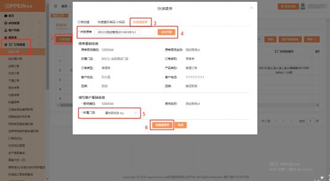
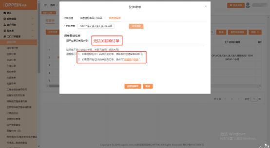

**13、原单在旧平台按照旧规则传单的，现在要下遗留单怎么下？**

**解决方案：**在工厂订单－我的订单－点击“订单创建”的按钮（需分配权限才有）

-快速遗留单－输入原合同号－点击关联， 出现以下情况：

情况 1：关联原合同号后，填写客户信息， 点确认，进入传单界面，  直接正常传

遗留单即可。

情况 2：关联不到原合同，怎么下遗留单？

1）如果橱柜木门的订单无法关联的， 橱柜可联系橱柜售后服务部门的管理员将  原单号添加进系统，即可关联成功。木门关联不上的需找经销部管理员协助处理。 2）如果衣柜卫浴的订单，无法关联的点下方橙色的“新增客户信息”的按钮，  出现填写客户信息的界面，  填写客户信息， 点确认。点击确认后，出现到新增遗  留单的界面，  填写相关信息上传附件，  正常传单即可）合同号按旧的合同号规则

传单即可。

