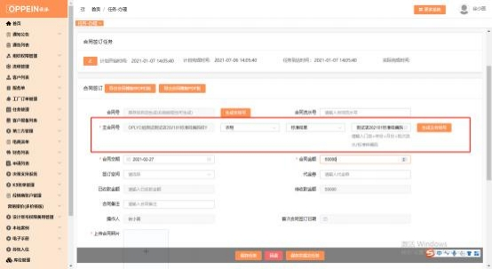
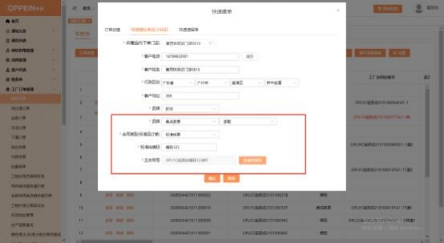
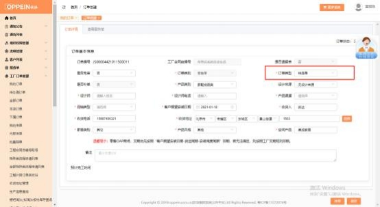

**14、按公司标准样品合同号下单的样品单怎么传单（含非标）？**

**解决方案： 1）下公司设计的样柜：**  需要建档，走流程到合同签订的任务时，合 同类型选“橱柜/衣柜/卫浴/木门”，合同类别选“标准样单”，出现标准样编辑 的输入框，  输入标准样编码， （如是非标准标准样品， 在标准样编码后面加非标 二字） 生成主合同号（见下图 1），完成并提交任务。 订单类型将自动默认为样

品单 （见下图 2），其他传单操作和正常单一样。

注：标准样单主合同号带“样”字

**2）下标准品（百货、家配等） 的标准样单：** 工厂订单管理－我的订单－点击“订  单创建”的按钮（需分配权限才有）- 快速建标准品，选择下单的门店，  填写客  户基本信息，  选择品牌、品类及对应的二级品类（单独百货、家配等） ，合同类  型为“标准样单” （注： 品牌品类和合同类型要依顺序选择），出现标准样编码  的输入框，输入标准样编码。点击 “点击生成”按钮即生成带“样”字的主合  同号（如下图 1），点击 “确认”跳转到订单基本信息界面（如下图 2），订单  类别默认为“零售单”、订单类型默认为“样品单”，设计来源默认“无设计来  源”， 必填项目（打\*号的）都填完后，点右下角的“保存”按扭， 点击“添加标  准品”的按钮（如下图 3） ，添加要下的产品即可。  注：空间产品默认该品类，

产品渠道、促销类型收货信息等都可手动选择。  下方图片为例。

