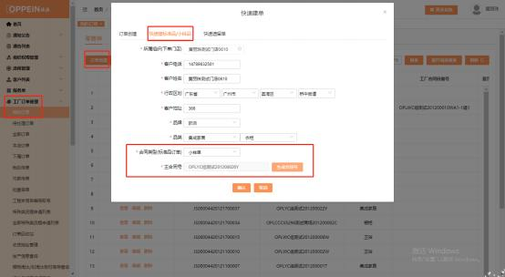
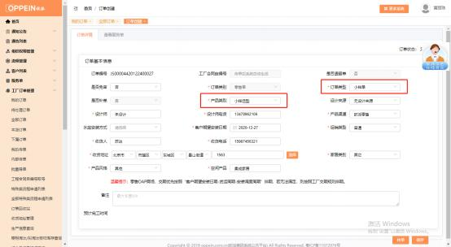

**16、小样单怎么传单？**

**解决方案：** 在工厂订单管理－我的订单－点击“订单创建” -快速标准品/小样单 -填写相关门店及客户信息， 合同类别选“小样单”，生成主合同号， 点确认后， 跳转到订单传单的界面，  订单类型将自动默认为小样单、产品类别默认为“小样 选型”，填写完其他项目后点击保存按钮，  再选择小样板单品或是套餐，  选择需

要下的产品后，传单即可。

注：传完单后合同号后面才会带“小样”字样

