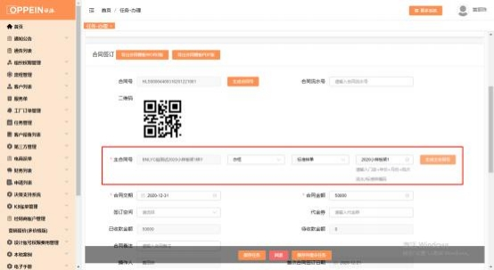

**17、小样板架怎么传单？**

**解决方案：**  需要像正常单一样建档、走流程， 签订合同的任务时订单类型选“标 准样单”，填写标准样编码时填写清楚“小样板架”字样， 生成主合同号（见下 图 1）；完成并提交合同签订任务后，  订单下单节点点击新增工厂订单（见下图

2），跳转到订单传单的界面，订单类型将自动默认为样品单（见下图 3），产

品类别为“普通订单”，保存信息后上传小样板架设计文件，  确认信息无误后传

单即可。

