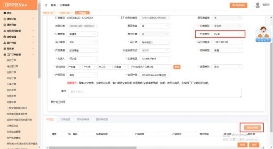
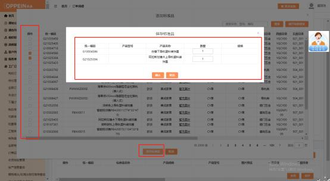

**18、CY 单怎么传单？**

**解决方案：**MTDS 的操作流程不变，一样需要建档，走流程到合同签订的任务时， 合同类型选“衣柜”，合同类别选“普通单”，生成主合同号（见下图 1），再 到订单下单的任务， 新增工厂订单（见下图 2）一订单传的界面传单－传单界面 产品类别选 CY 单（见下图 3），保存后， 点击右下角的“添加标准品”的按钮， 选择要下的五金配件传单即可 （见下图 4）。 备注：集成家居五金遗留单产品

类别需要选择单独五金。

