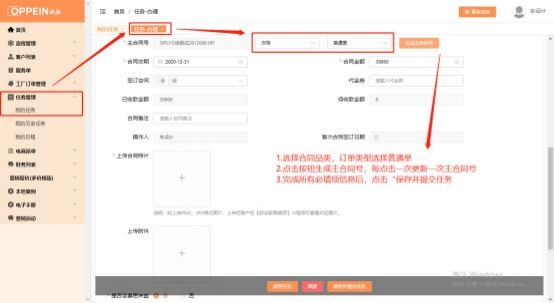
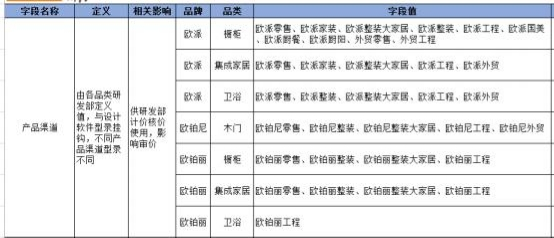
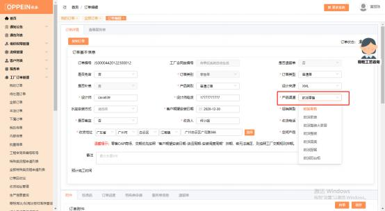

**20、家装单、整装单怎么下？**

**解决方案：**   MTDS 的操作流程不变，   一样需要建档，  走流程到合同签订的任务  时， 合同类型选对应品类（衣柜、橱柜、卫浴、木门） ，合同类别选“普通单”， 生成主合同号（见下图 1），再到订单下单的任务，新增工厂订单 （见下图 2） 一订单传的界面传单－产品渠道（各品类产品渠道对照见下图 3）选择对应的家

装和整装的渠道 （见下图 4） ，正常传单即可。

注意：

1）新合同号规则上线后家装、整装单的合同号上不再带家装和整装的字样；

2）家装或整装单，产品类别必须选择对应的家装或整装产品类别；

3）橱柜、衣柜、木门、卫浴品类、设计来源为 XML 的定制品订单，  上传附件保

存后系统自动解析附件中的产品渠道。

