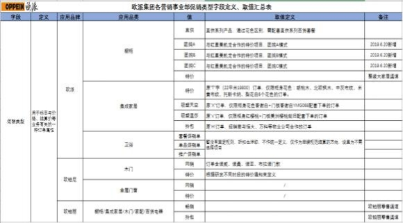
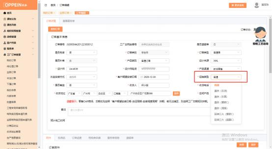

**21、各品类直销、特价、团购、网销、畅销、拎包等促销单怎么传单？**

**解决方案：**  MTDS 的操作流程不变，  一样需要建档，   走流程到合同签订的任务  时， 合同类型选对应品类（衣柜、橱柜、卫浴、木门） ，合同类别选“普通单”， 生成主合同号（见下图 1），再到订单下单的任务，新增工厂订单 （见下图 2） 一订单传的界面传单－促销类型（各品类促销类型对照表见下图 3）选择对应的  促销类型 （见下图 4） ，正常传单即可。（注：  1.新合同号规则上线后促销类型

的将不在合同号上面体现；2.不属于促销的订单 ，促销类型选择“普通” ）。

