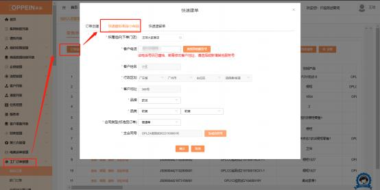
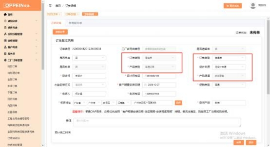
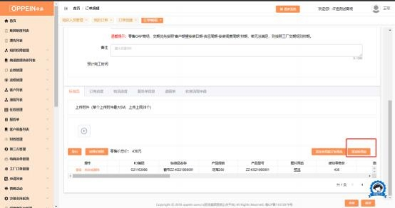
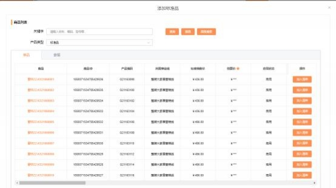

**22、软装标准品怎么下单？**

**解决方案：**  工厂订单－我的订单－点击“订单创建”的按钮。

选择下单的门店， 自动带出的客户电话、客户姓名与行政区划，可点击【清除】 按钮一键清除， 重新手动填写；  再选择合同类型为“普通单”，点击下面的“生  成合同号”按钮， 生成主合同号（如下图 1，点一次生成一个合同号，  点多次生

成的合同号会递增，  不要多点） ，点击下面的“确认”按钮， 跳转到订单下单的

界面传单，  传单时订单类别默认为“零售单”、订单类型默认为“普通单”，产 品类别默认为普通订单，    必填项目（打\*号的）都填完后（无设计来源） ，点右

下角的“保存”按扭。

点击“添加标准品”的按钮， 可继续添加。选择标准品，  加入清单；可修改标准

品数量等，点击确认。确认好所有的标准品信息后，点击传单即可。

