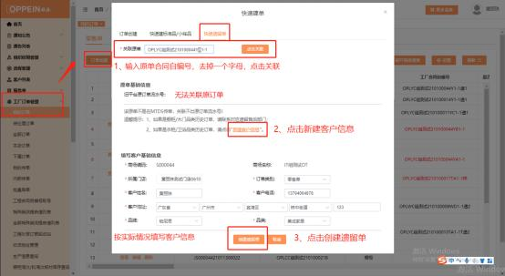
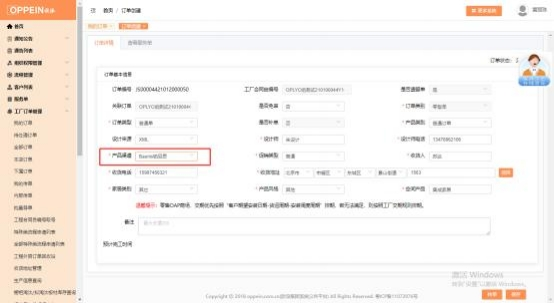
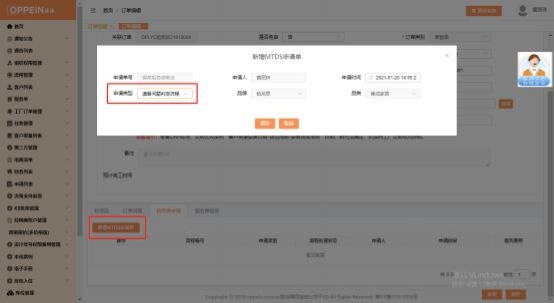
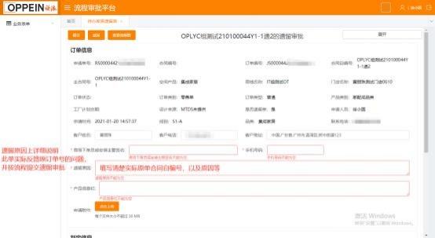

**24、原单是欧派集成家居， 遗留单需要下铂尼思集成家居的怎么下？**

**解决方案：**

（1）工厂订单管理-我的订单-订单创建-快速遗留单， 输入原单合同后，  将原单

合同号删除一个字母，点击关联；

（2）点击新建客户信息，按照实际情况填写客户信息、选择品牌为铂尼思，点

击创建遗留单；

（3）跳转订单详情界面，产品渠道选择铂尼思，保存订单信息，上传附件等；

发起遗留责任判定，在遗留原因中填写实际原单合同号，按流程提交即可

操作指引如下图：

