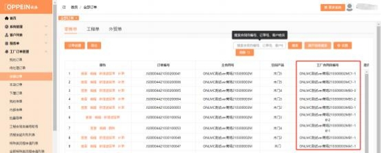

**25、新取号规则下的木门订单合同号是怎样的？**

**解决方案：**  自 2021 年 3 月 4 日起，木门品类的订单合同号新增批次流水编码， 以 ONLMC 重庆市 210300003MB3-2 为例：“ONLMC 重庆市 210300003M” 为主合同号，“B”为提交批次码，是指该主合同号下操作的第二批次传单（订

单批次由 A-Z 依次区分） ，“3-2”的“3”意味该批次上传订单总数为 3，“2”

为该批次 3 个订单中的第二个订单，  这三个订单做为同一批的订单进行齐套发

货。

另：若下补单或遗留单，则在原工厂合同自编号后增加订单类型码和次数码：

（1 ） 如 下 补 单 ， 则 在 补 单 的 工 厂 合 同 自 编 号 为 ： ONLMC  重 庆 市

210300003MB3-2 补 1；

（2）如下遗留单， 则遗留单工厂合同自编号后增加“遗”字与序号： ONLMC 重

庆市 210300003MB3-2 遗 2

