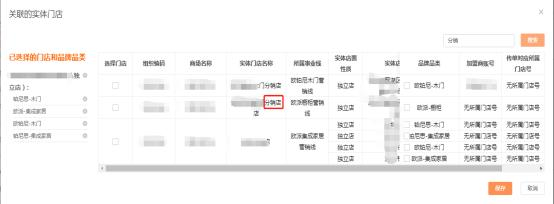
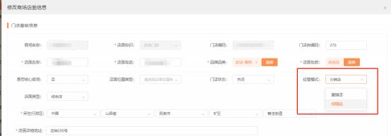

**27、橱柜分销店的订单怎么下？**

**解决方案：** 系统管理员 admin 账号登录 MTDS 系统在组织权限管理给虚拟门店

关联店面性质为分销店的实体门店，保存。关联成功之后，才能下分销的订单；

若关联实体门店时找不到分销店，需要找橱柜经销部管理员前往 UC 系统新增， 再由商场在 MTDS 系统组织权限管理-组织人员管理中关联该分销实体门店， 其

余与正常传单操作一致。

