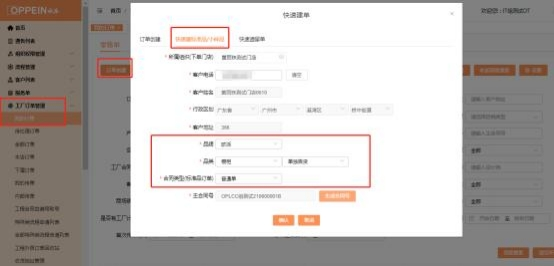
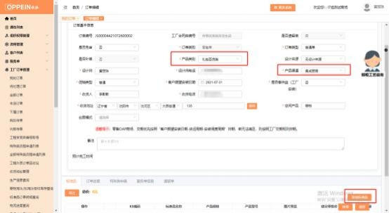
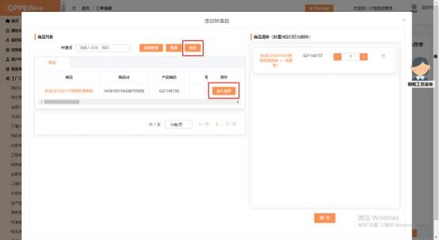
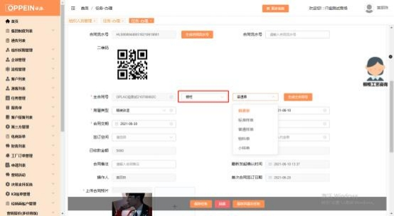
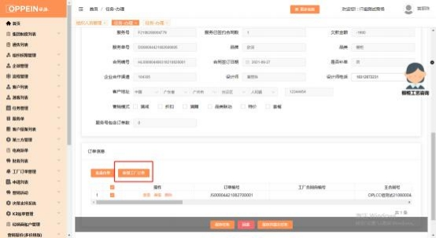
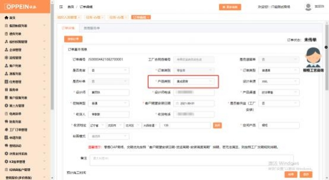

**28、欧派集成灶（集成厨房）怎么下单？**

**解决方案：**

**（1）单下集成灶标准品**

工厂订单管理-我的订单-订单创建-快速标准品，新增一个单独百货订单， 品牌 品类选择【欧派-橱柜-单独百货】， 合同类型选择【普通单】或【普通样单】   ， 生成主合同号后，  点击确认（见下图 1），跳转传单界面，  产品类别为【礼包百 货类】、产品渠道选择【集成厨房】（见下图 2），保存订单后添加标准品下单

即可。

**（2）定制柜＋集成灶标准品**

需要在 MTDS 建档、走订制品流程，到合同签订任务时品类选【**橱柜**】，合同

类型可选择普通单、标准样单或普通样单；

在订单下单任务新增工厂订单、跳转传单界面，  产品类别选【**集成厨房**】， 订单

保存后，下方出现附件栏可上传设计文件；标准品需在设计软件添加。

