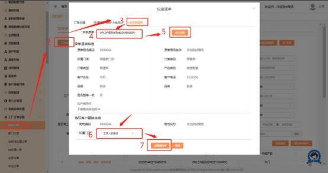

**32、快速遗留单需要怎么创建？**

**解决方案：** 工厂订单管理－我的订单－点击“订单创建”的按钮（需分配权限才 有）- 快速遗留单。在关联原单处，  **输入原单完整的合同号，**  点击关联，会带出 原单的基础信息。在填写客户基础信息处，  默认当下账号的商场组织编码，  所属 门店可以选择需要下单的门店， 点击创建遗留单即可。创建后的遗留单下单流程

和正常单操作一致。

**注：** 此快速遗留单创建入口，本商场的遗留单和跨组织编码的遗留单都适用。

