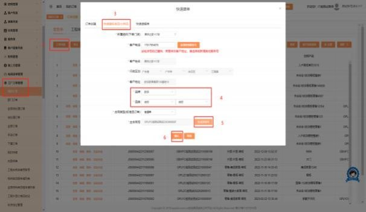
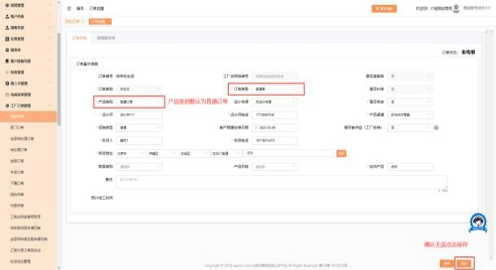
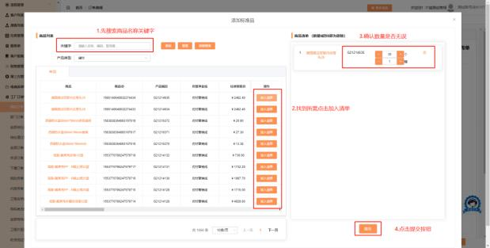

**33、快速标准品订单（优材）怎么下？**

**解决方案：**

**1、**工厂订单管理－我的订单－点击“订单创建”的按钮（需分配权限才有）- 快

速建标准品，选择（开通欧派优材） 的门店， 填写客户基本信息，  品牌选： 欧派，   品类选择：优材，品类后面的分类框选择“优材”，再选择合同类型为“普通单” （注： 品牌品类和合同类型要依顺序选择）， 点击下面的“点击生成”按钮， 生   成主合同号（如下图 1 点一次生成一个合同号， 点多次生成的合同号会递增， 请

不要多点） ，点击下面的“确认”按钮；

2、跳转到订单下单的界面传单（如下图 2），传单时订单类别默认为“零售单”、  订单类型默认为“普通单”、产品类别默认为“普通订单” ，不能手动再选择，

必填项目都填完后 ，点右下角的“保存”按扭；

3、出现“添加标准品”的按钮（如下图 3），点击“添加标准品”的按钮， 添加 要下的产品即可。传单界面带星号字段为必填项。注：空间产品默认该品类，产

品渠道、促销类型、收货信息等都可手动选择。

图一

图二

图三

