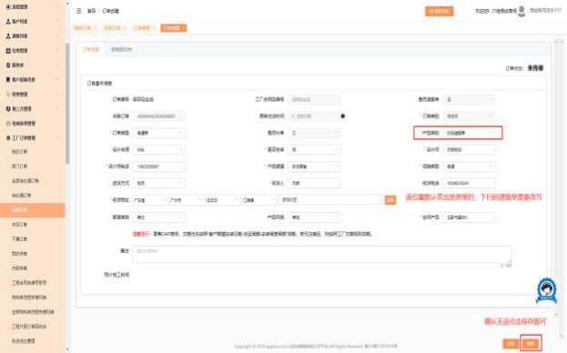
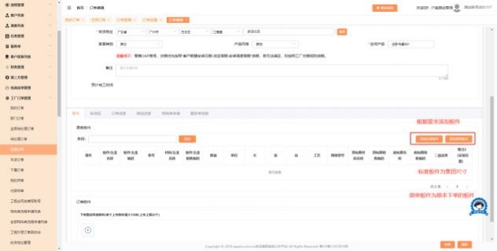
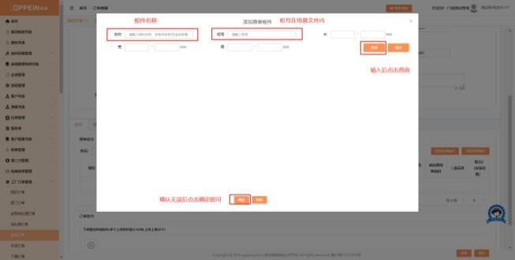

**34、集成家居扫码遗留单如何下单？**

**解决方案：** 在工厂订单－订单列表－找到集成家居原合同－操作栏点击“新增遗  留单”，   出现到新增遗留单的界面， 产品类别会默认带出原单的， 届时需要修  改产品类别为“扫码遗留单” （如图一），其余字段可修改或与原单一致； 确认  无误保存后，下拉至添加板件选项（如图二）  ，选择所需板件添加后传单即可！

（如图三）

图一

图二

图三

