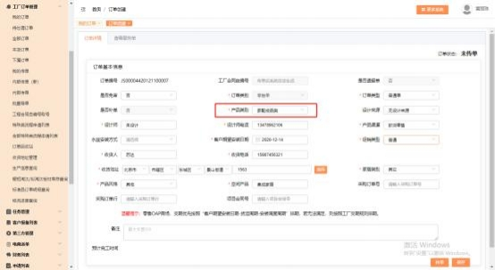
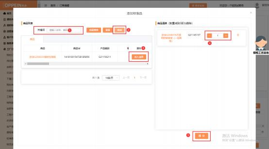

**5、快速标准品订单（有衣柜有家配）怎么下？**

**解决方案：**MTDS 的操作流程不变，一样需要建档，走流程到合同签订的任务时，  合同类型选“衣柜”，合同类别选“普通单”，生成主合同号（图 1），再到订  单下单的界面，  产品类别选择“家配成品类”，设计来源不需要选择，  将其他必  填项填写完成后点击保存（图 2） ，点击右下角的“添加标准品” （图 3）， 选  择需要下单的标准品后点击“保存标准品” ，填写标准品数量，点击“确认”， 标准品添加成功后点击“传单”，核对传单信息，无误后点击“传单”， 订单将

传至工厂。

注：家配的订单不能和衣柜的单一起批量传单，需要分批次传单。

