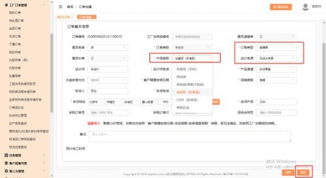

**6、快速标准品订单（卫浴标准品） 怎么下？**

**解决方案：** 工厂订单管理－我的订单－点击“订单创建”的按钮（需分配权限才 有）- 快速建标准品，选择下单的门店， 填写客户基本信息， 选择品牌，品类（卫 浴），品类后面的分类框选择“卫浴”，再选择合同类型为“普通单” （注： 品 牌品类和合同类型要依顺序选择）， 点击下面的“点击生成”按钮， 生成主合同 号（如下图 1，点一次生成一个合同号，点多次生成的合同号会递增，不要多点）， 点击下面的“确认”按钮， 跳转到订单下单的界面传单（如下图 2），传单时订 单类别默认为“零售单”、订单类型默认为“普通单”、产品类别可手动选择卫 浴对应的标准品，比如：浴室柜（标准品）、OEM（标准品）等， 必填项目都 填完后（无设计来源）点右下角的“保存”按扭， 下面出现“添加标准品”的按 钮（如下图 3），点击“添加标准品”的按钮， 添加要下的产品即可。传单界面 的带星号字段为必填。注：空间产品默认该品类，产品渠道、促销类型收货信息

等都可手动选择。

另： 浴室柜（标准品）一个订单只能下一个浴室柜标准品；  OEM（标准品） 一个

订单可以下多个标准品。

