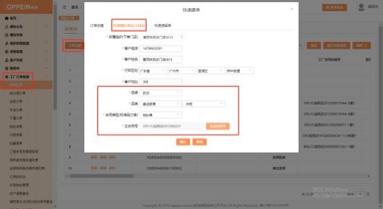
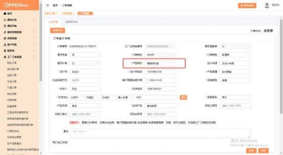

**7、快速标准品订单（营销物料）怎么下？**

**解决方案：** 工厂订单管理－我的订单－点击“订单创建”的按钮（需分配权限才  有） - 快速建标准品 ，选择下单的门店， 填写客户基本信息，选择品牌 ，品类， 品类后面的分类框选择对应的品类（橱柜、衣柜、木门、卫浴），再选择合同类  型为“物料单” （注： 品牌品类和合同类型要依顺序选择）， 点击下面的“点击  生成”按钮， 生成主合同号（如下图 1，点一次生成一个合同号，  点多次生成的  合同号会递增，  不要多点） ，点击下面的“确认”按钮， 跳转到订单下单的界面  传单（如下图 2），传单时订单类别默认为“零售单”、订单类型默认为“普通  单”，产品类别自动默认为营销物料， 必填项目（打\*号的）都填完后（无设计  来源），点右下角的“保存”按扭，下面出现“添加标准品”的按钮（如下图 3）， 点击“添加标准品”的按钮，添加要下的产品即可。 注：空间产品默认该品类，

产品渠道、促销类型收货信息等都可手动选择。  下方图片为例。

