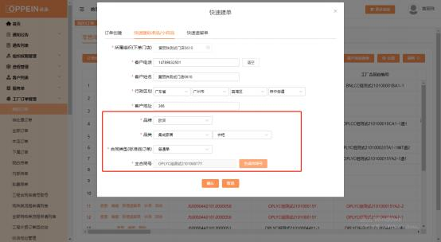
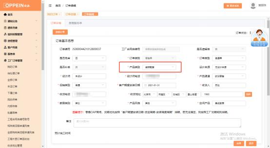

**8、快速标准品订单（装修配套）怎么下？**

**解决方案：** 工厂订单管理－我的订单－点击“订单创建”的按钮（需分配权限才 有）- 快速建标准品，选择下单的门店，  填写客户基本信息，  选择品牌品类、合 同类型为“普通单”（注：品牌品类和合同类型要依顺序选择），点击下面的“点 击生成”按钮， 生成主合同号（如下图 1，点一次生成一个合同号，  点多次生成 的合同号会递增，  不要多点） ，点击下面的“确认”按钮， 跳转到订单下单的界 面传单（如下图 2），传单时订单类别默认为“零售单”、订单类型默认为“普 通单”，产品类别选择“装修配套”， 打\*号的必填项目都填完后（无设计来源， 备注框必填所点将的展示设计师姓名） ，点右下角的“保存”按扭，下面出现“添 加标准品”的按钮（如下图 3），点击“添加标准品”的按钮， 添加要下的产品 即可。注：空间产品默认该品类，产品渠道、促销类型收货信息等都可手动选择。

下方图片为例。

