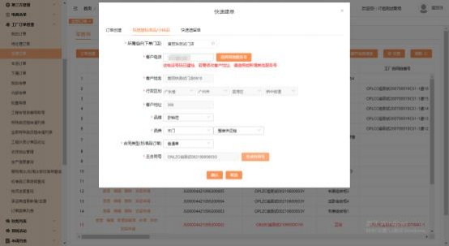
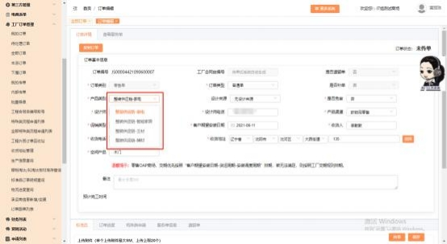

**9、快速标准品订单（整装供应链） 怎么下？**

**解决方案：** 工厂订单管理－我的订单－点击“订单创建”的按钮（需分配权限才

有）- 快速建标准品，选择下单的门店， 填写客户基本信息， 选择品牌（欧铂尼） ，

选择品类（木门） ，品类后面的分类框选择“整装供应链”，再选择合同类型为  “普通单”（注：品牌品类和合同类型要依顺序选择），点击下面的“点击生成” 按钮， 生成主合同号（如下图 1，点一次生成一个合同号，  点多次生成的合同号  会递增， 请不要多点） ，点击下面的“确认”按钮， 跳转到订单下单的界面传单

（如下图 2），传单时订单类别默认为“零售单”、订单类型默认为“普通单”、

产品类别可选择“整装供应链-家电/智能家居/主材/辅材” ，必填项目都填完后， 点右下角的“保存”按扭， 下面出现“添加标准品”的按钮（如下图 3），点击

“添加标准品”的按钮，添加要下的产品即可。传单界面带星号字段为必填项。

注：空间产品默认该品类，产品渠道、促销类型收货信息等都可手动选择。

