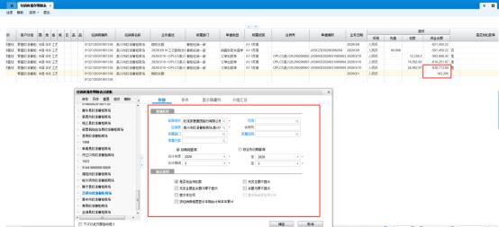

**11、橱柜传单时提示“当前商场余额为负数， K3 编码为：\*\*\*\*\*\*\*\*，**

**无法传单，请及时充值” ，经销部审价又说账面上有款，怎么处理？**

**解决方案：** 只要商场管理员在后台的传单余额校验规则是否生效那里选了是， 传

单的时候就会启动余额校验。

此报错校验 K3 系统的打款，检查下商场余额是不是真的没钱了，还要检查打款

后总部财务是否把款做进了 K3 系统，具体需要去联系审价查询。

