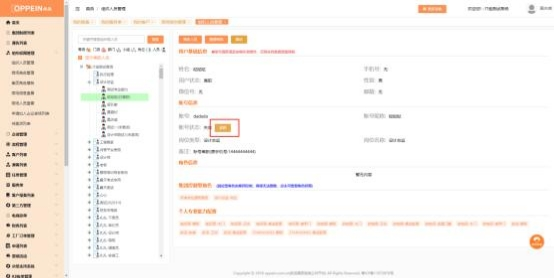

**14、CAXA 账号购买时出现校验提示“当前已选中的[]启用状态异**

**常， 当前仅支持已启用状态的 MTDS 账号购买对应的计费服务”？**

**解决方案：** 选择购买的设计师账号为失效状态， 需要先将设计师账号设为正常状

态才可以购买 CAXA 账号。 操作如下：

登陆 admin 的账号，  进入组织管理菜单，在组织人员管理中搜索到对应的人员 （没有找到可能是离职了，  点击是否离职再查看） ，点击人员姓名，  点击复职按 钮即可成功复职。当前账号状态为未激活状态，  然后用该账号登录 mtds，点击 登录之后系统会自动提示你激活， 成功激活之后账号就可以正常使用了， 再次点 击设计师账号费用管理就可以购买 caxa 账号了 。如果账号状态为禁用需要

admin 在组织架构上去激活才行。

