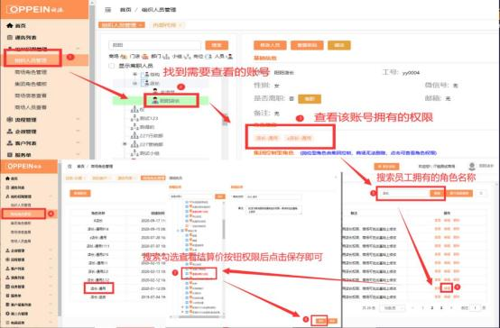

**16、怎样给商场员工配置查看结算价的权限？**

**解决方案：**  ①登录系统管理员（admin）账号在组织管理中找到对应的员工账

号，查看该账号拥有的角色

②点击商场角色管理找到该员工角色点击编辑，搜索并勾选【查看结算价按

钮】权限后保存即可。具体操作如下图

③取消员工查看结算价权限操作步骤如上，取消勾选【查看结算价按钮】权

限，保存即可。

注意：我的订单、本店订单、我的下属订单、全部订单均有查看结算价权限

