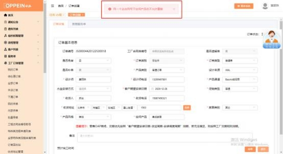
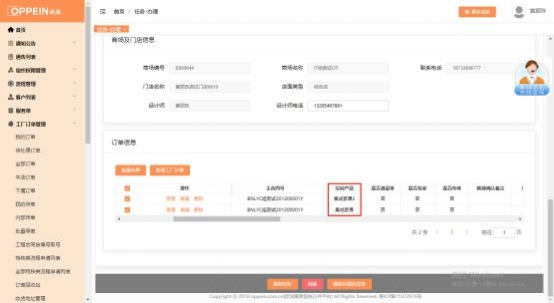
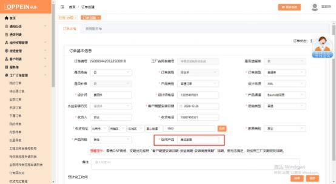

**2、保存订单时提示“同一个主合同号下空间产品名不允许重复”怎**

**么办？**

有此提示的原因是同一服务单下这个订单的空间产品名已有订单用过了。

**解决方案：** 1）、需检查该服务单下的订单， 里面是否有两个重复的空间产品名，

检查文件删掉其中不要的一个；

2）若同客户同空间确实有两套同样的产品，  则在空间产品名的后面加编号 （主

卧衣柜 001、主卧衣柜 002）进行区分即可，设计文件及传单界面的空间产品名

也要对应修改；将空间产品进行更改后再重新传单

