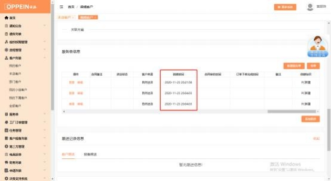

**23、已经关联好服务单， 走到了订单下单，但拆单时提示“请先关联**

**服务单”或“服务单还未签订合同”怎么办？**

**解决方案：**  请检查自己 caxa 关联客户的服务单与 mtds 的服务单号是否一致； 不一致的话， 另存方案，重新进行关联；有时因误操作， MTDS 生成的服务号生

成了两条服务单 001 与 002 ，设计师使用 caxa 方案关联了服务号 001，但在

MTDS 上使用 002 走完了全流程（存在导购将重复服务单 001 删除的情况） ，

这时客户姓名等都一致，所以设计师自己查不到问题。

