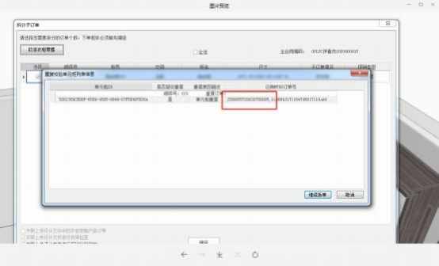

**26、有个订单退单了但重传时， CAXA 里并没有重传的文件，拆单的**

**时候提示有重复订单？**

**解决方案：**  根据提示的重复单号在 MTDS 上检查，检查没问题就上传，有问题 就删除其中一个即可。原来的订单里有这个柜子，  系统担心重复订单，做了提醒 的功能； 只要检查两个订单不一样， 就可以；  mtds 也会保存删除的订单号，  所

以之前有删除过的相同订单也会有提示，这种自己检查没有重复就可以。

