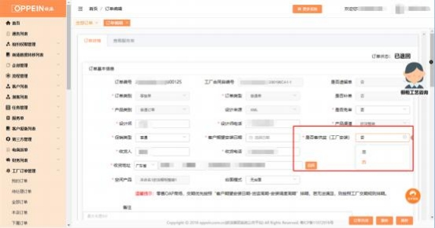
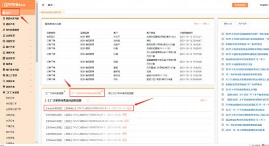
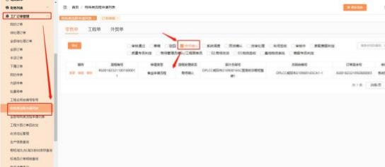
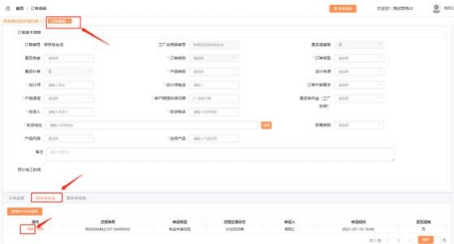
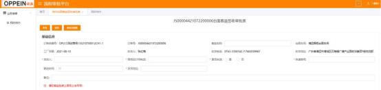
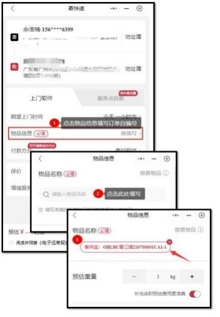

**27、订单里有客供盆怎么下单？**

**解决方案：**

**1、客盆流程发起：**  上传订单时，【是否客供盆（工厂安装）】需按实填写，

订单有需要寄到工厂安装的客供盆，就选”是“ ；没有就选 ”否“ ；当选择**是**

时，系统自动启用流程；

注：已退回状态的订单，是否客供盆允许改选；若由否改选【是】，重传订单

后系统自动发起客供盆流程。

**2、客盆寄送处理：**  订单状态为“排产待确定”后将生产基地及寄送信息推给  商场 ，系统自动计算出“客盆的寄送地址、联系人、电话”等信息，商场根据

该信息进行客盆的寄送 ，步骤如下：

2\.1 MTDS 首页-工厂订单特殊类流程消息提醒：含【客盆申请流程】【商场确

认】的单据即为商场待处理的客盆审批单。

或：进入“工厂订单管理-特殊类流程申请列表”，选择“商场确认”。  （**注：** 若商场 MTDS 没有特殊类流程申请列表和“商场确认”，请用对应 admin 账

号设置开通，相关操作可联系 MTDS 答疑人员。）

2\.2 进入订单编辑界面，在“特殊类申请”找到客盆审批流程，点击“编辑”

2\.3 跳转到流程审批平台， 出现商场确认信息填写界面，填写信息，  左上角点

击审批提交。

注： ①自送： 商场将客盆送到工厂 （选是） 或工厂人员上门拿盆 （选否） ；

②若不能进行填写，请确定审批单内当前节点是否为“商场确认”，或当前登

录的账号是否为传单账号，不是则无法填写。

**3.快递单填写指引**

3\.1 工厂建议快递：  顺丰、京东物流、德邦，且勿选择到付；

3\.2 物品信息填写规范：物品信息务必填写 MTDS 的工厂合同自编号，用于车

间装盆对照实际订单，如：  ”客供盆： OBLBC 黄江镇 210700001CA1-1”：

