**34、退单重传时遇到报错“重传订单中的【产品类别】不允许修改，**

**请确保与原单值一致后方可继续创造”怎么办？**

**解决方案：** 退单重传的订单，  订单类别、订单类型、产品类别、产品渠道以及空

间产品名需要与退单前保持一致， 不能修改； 若是选错导致退单（如产品类别选

错了导致的退单），建议新建一个订单，选错的订单可以关闭。

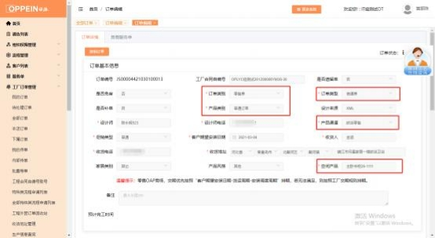

**35.下护墙板时，传单界面提示“若使用 caxa 软件，请上传[hdf、**

**xls/xlsx、 pdf]文件”，请上传后再传单，怎么办？**

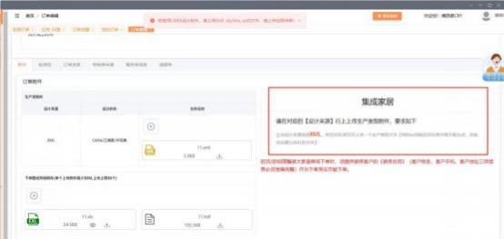

**解决方案：**  确认一下是否使用了衣柜品类的合同号去下木门单，例如护墙板需 要用品牌品类为欧铂尼木门的服务单取号下单，不能走衣柜的渠道下单。若品

牌品类选错了，可前往客户列表添加正确品类的服务单（见下图）。

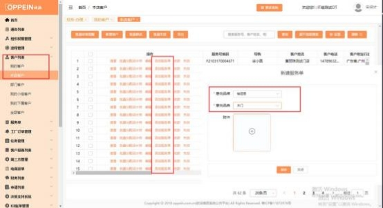

**36、订单回收影响齐套发货吗？**

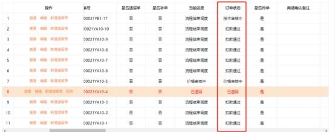

**解决方案：**  同一批次传单的订单中，  有订单被商场操作回收，  未进行重传或关闭

订单， 该订单进度停滞，  同一批次的其他订单由于齐套规则不能正常发货，  建议

状态异常的订单及时重传或关闭订单。

**37、传单界面的产品类别怎么选不到 OP 整装专供了？拆单的时候**

**报错不能下产品渠道为【欧派整装】的订单是什么原因？**

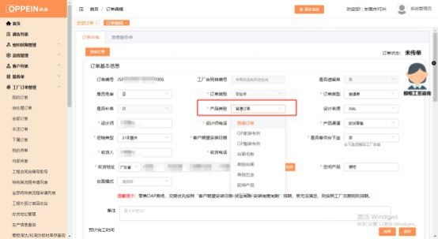

**解决方案：** 橱柜经销部将零售渠道和整装渠道做了业务划分，商场需要确认订 单归属的门店，零售的门店只能下零售单，整装门店只能下整装单，归属门店

需要调整的，前往客户列表勾选相应服务号，批量修改门店后再传单。

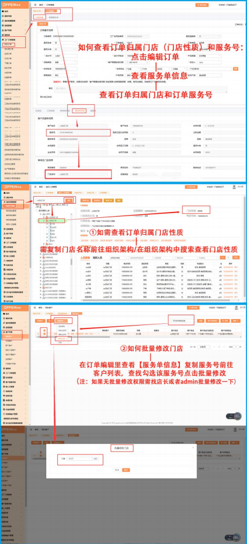

**38、合同签订任务生成的主合同号怎么变了？以前是 LCC 的怎么变**

**LCZ 了？**

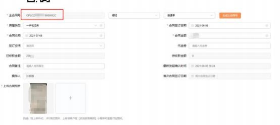

**解决方案：** 合同号中的 LCC 或 LCZ 都是渠道代码，分别代表零售-橱柜-常规、 零售-橱柜-整装， 若合同号渠道代码变更为 LCZ，需确认该服务单归属组织所关 联的实体门店，  是否为整装店。查询路径如下：  服务单信息-所属组织（门店）  - 复制该门店名称， 前往组织人员管理， 搜索-点击【修改门店】-【选择实体门店】，

即可查看实体店面性质，若为整装店，则合同号渠道代码会有 Z。

**39、促销类型这里无数据怎么办？**

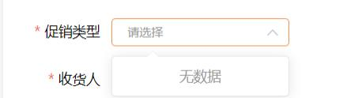

**解决方案：** 促销类型由经销部管理员在 UC 后台维护，  若传单界面出现促销类型

无数据，或选不到某种促销类型，联系对应经销部管理员在后台维护上即可

**40、传单时提示“该服务单合同类型不允许下该订单类型的单，请重**

**新关联其他服务单或修改订单的订单类型”**

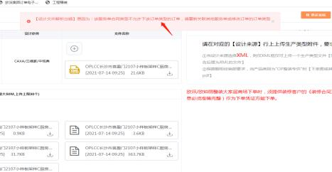

**解决方案：**  该提示是系统校验到 MTDS 里面选择的订单类型与设计软件所选择 的订单类型不一致，需修改 MTDS 或设计软件里面的订单类型，保证二者一致

即可。 MTDS 订单类型所在页面如下图

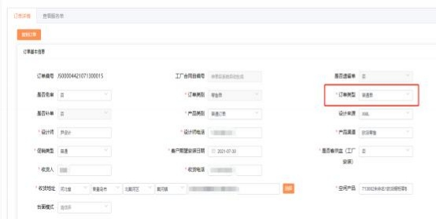

**41、如何查看订单结算明细清单？**

**解决方案：**  工厂订单管理列表-我的订单-编辑-订单进度-查看结算价-结算明细

清单（点击即可下载）

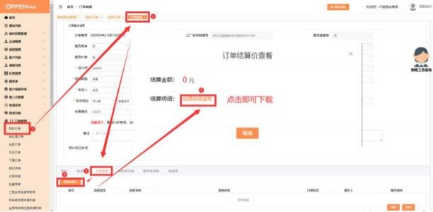

**42、橱柜商场如何查看 K3 账单详情？**

**解决方案：**    商场可登录PC端或APP端查看对应账单信息，具体操作如下

① PC端：登录系统管理员（admin）账号-K3账单管理-账单查询-点击账单汇

总明细即可查看详细账单记录（如图1）

②APP端：登录系统管理员（admin）账号-首页点击数据中心-点击账单即可

查看账单详情（如图2）

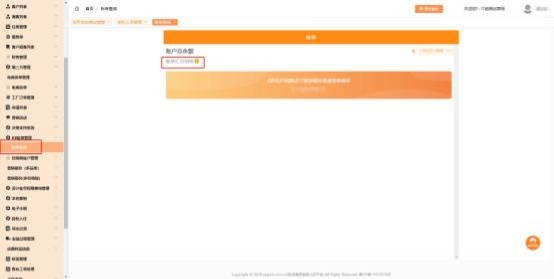

图1

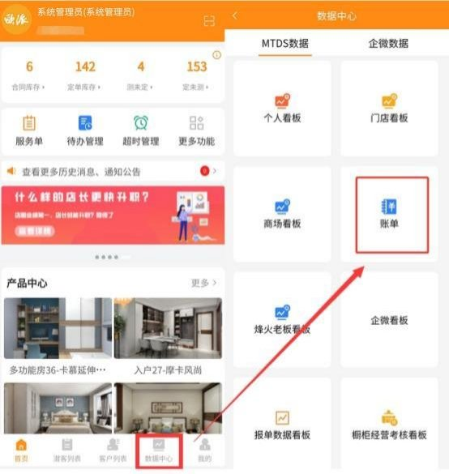

图2

**43、传单报错：客户地址的省、市、区和详细地址必填，请填写完整**

**后再传单，怎么办？**

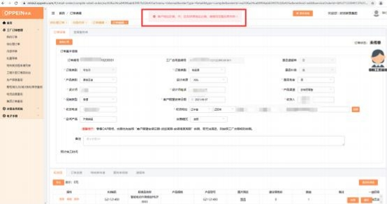

**解决方案：**

建档人或有权限的员工在客户列表找到该客户， 点击编辑， 完善客户地址的行政

区划与详细地址，保存即可

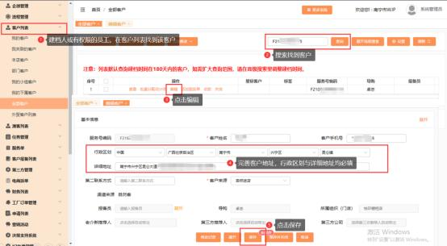

**44、怎样给商场员工配置查看结算价的权限？**

**解决方案：**  ①登录系统管理员（admin）账号在组织管理中找到对应的员工账

号，查看该账号拥有的角色

②点击商场角色管理找到该员工角色点击编辑，搜索并勾选【查看结算价按

钮】权限后保存即可。具体操作如下图

注意：我的订单、本店订单、我的下属订单、全部订单均有查看结算价权限

**45、如何设置不让商场员工查看结算价？**

**解决方案：**  ①登录系统管理员（admin）账号在组织管理中找到对应的员工账

号，查看该账号拥有的角色

②点击商场角色管理找到该员工角色点击编辑，取消勾选【查看结算价按钮】

权限后保存即可。具体操作如下图

注意：该账号所拥有角色只要其中一个角色勾选了查看结算价按钮，那该账号 同样可以看到结算价（我的订单、本店订单、我的下属订单、全部订单均有查

看结算价权限）

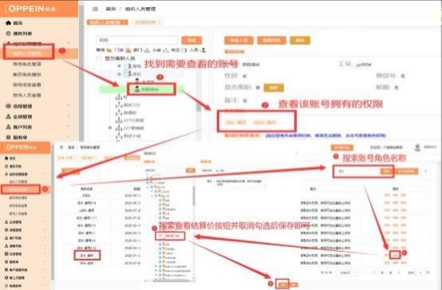

**46、传单界面复制订单的按钮怎么找不到了？**

**解决方案：**复制订单按钮默认配置给 admin、设计师与下单员岗位的  MTDS

账号， 其他岗位账号需要配置权限， 操作路径如下： admin 账号登录→商场角色

管理→编辑→查询勾选【复制订单按钮】，保存即可

**47、添加标准品搜索不出来，如何处理？**

**解决方案：**①在订单基本信息，  确认产品类别、产品渠道、是否直发， 等字段

有无选错 （见下图 1）；

②若确认无误，可在标准品栏-添加标准品-点击高级搜索，  确认营销线、品牌品

类、 一级目录等字段是否正确（见下图 2）；

③确认无误后还是无法搜索到产品，请提供产品型号编码和订单基本信息页面截

图给答疑老师核查。

Mtds 企微答疑群二维码 可以加群咨询

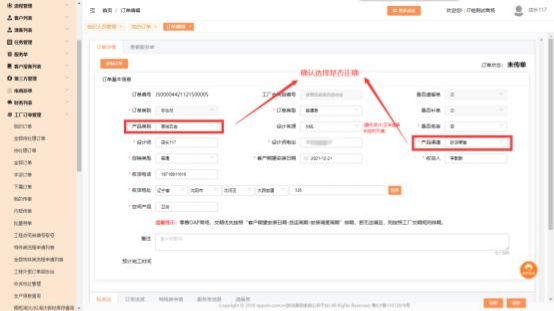

图一

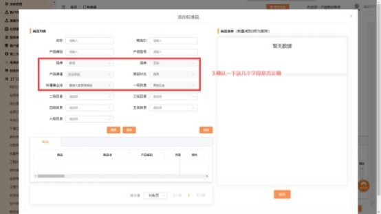

图二

**48、提示： 下单门店不允许下产品类别/产品渠道为 XXX 的订单，如**

**何处理？**

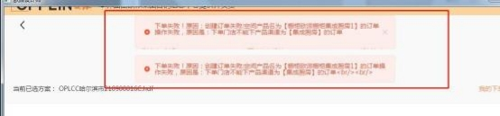

**解决方案：**①服务单列表-找到对应服务单-点击编辑或查看-基本信息，检查服

务单所属组织（门店）  ，确认下单门店是否正确（见下图 1、2）；

②若商场检查下单门店有误， 在客户列表勾选该客户服务号，  操作修改门店，  改

为正确的下单门店（见下图 3）；

③若商场检查门店信息无误， 但是仍然出现上述报错,请提供组织编码、账号、密

码、服务单号给答疑老师核查。

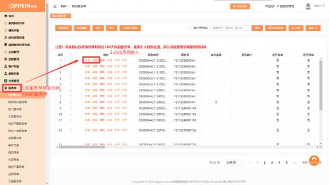

图一

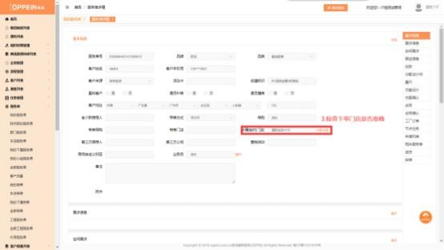

图二

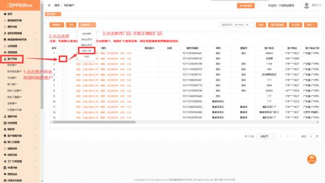

图三

**49、设计软件拆单时产品类别为空怎么办？**

**解决方案:**

1、**设计软件与 MTDS 中的订单对应合同类型不一致**，需改为一致方可下单

MTDS 界面

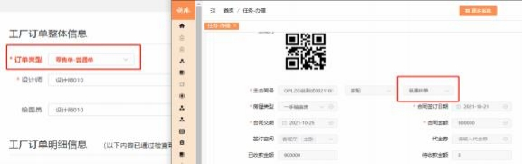设计软件界面

|**合同类型**|**订单类型**|
| :- | :- |
|普通单、物料单|普通单|
|标准样单、普通样单|样品单|
|小样单|小样单|

2、**是否补单、遗留单选项不能同时选“是”**：

①若下补单，请到场景中取消模型上是否遗留的勾选（下图 1）；②若下遗留

单，则是否补单需要选“否”（下图 2）。

注：是否补单选“是”后，勾选要拆单的所有订单都会被定义为补单，故补单

和普通单、遗留单不能一起拆单

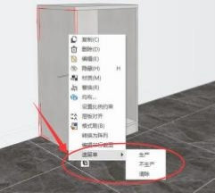

（图 1）

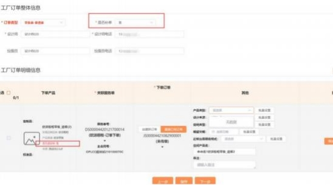

（图2）

**50、系统报错“调用 CRM 接口失败，原因是： 门店或商场没有 xxxx**

**的经营权限，不允许添加！ “怎么办？**

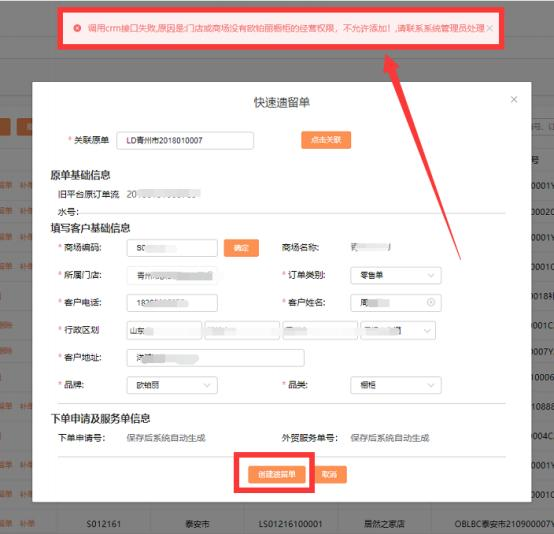

**解决方案：**当操作客户建档、业务员报备、电商派单、创建标准品/小样品订

单、快速创建遗留单、内部代传、批量导单时，会触发系统的建档校验，  有两

种情况：

① 客户所属虚拟门店没有关联对应品牌品类的实体门店，需要 admin 在组织

人员管理中找到该虚拟门店，操作修改门店-关联实体门店。

② 该商场对应品牌品类的经营权扩展信息状态为【拟淘汰】/【淘汰】  ，此状

态下该品牌品类不能建档。  请反馈给经销部管理员，让其在 UC 系统上核查

该品牌品类经营权扩展信息是否为【正常】，恢复正常后方可下单。

**51、订单取消后如何重新创建订单？**

**解决方案：**  在工厂订单管理-我的订单-订单创建中，输入下单的服务单号，点

击确认关联服务单号下单。

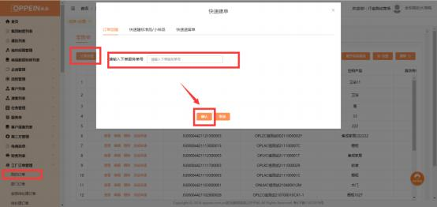

**52、提示下单门店未关联欧派-品类的实体门店？**

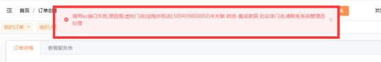

**解决方案：**

**情况一：**该门店没有关联对应品牌品类的实体门店，  要用系统管理员账号将此

门店关联对应品牌品类的实体门店（如图 1-2）。

**情况二：** 该门店原先关联对应品牌品类的实体门店状态异常， 需要联系经销部管 理员在 UC 系统中检查实体门店状态（如图 3），若异常，需用  admin 账号将

该虚拟门店重新关联状态正常的实体门店（如图 1-2）。

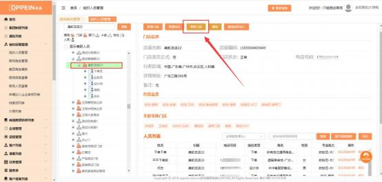

图 1

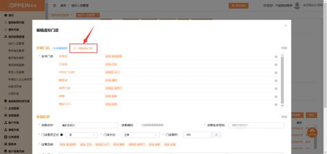

图 2

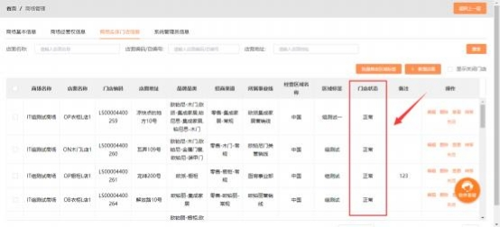

图 3

**53、木门订单退回提示：“您的订单存在问题， 具体问题是请重新配**

**置门店再上传， 请修正后重新提交”怎么处理？**

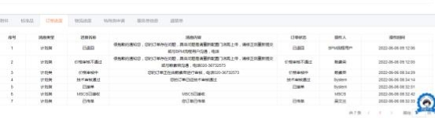

**解决方案：**

**出现此退单情况的原因：** 根据集团衣木事业线业务调整通知，  衣木综合经销商  “欧铂尼"木门业务划归集成家居营销事业部管辖，故需对系统中门店的设置进

行调整， 具体操作如下：

1、需登录系统管理员 admin 账号， 完成相关门店以下配置（以“门店”为

例，其他问题门店操作一致）

2、进入左边菜单栏：  组织人员管理-选择门店-修改门店【图一】点击关联门店

【图二】勾选欧派集成家居营销线【图三】

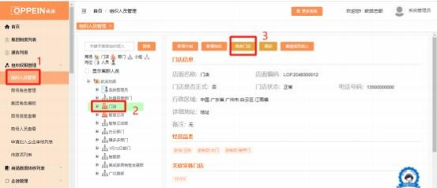

【图一】

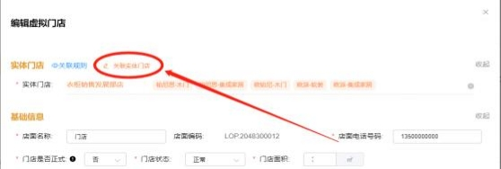

【图二】

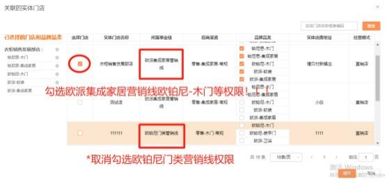

【图三】

**特别提示：**  在完成上述配置前，相关门店客户已生成木门主合同号（ 

……），如需下单， 必须对客户所在的门店，完成以上配置后重新建档、签合同取到衣柜线

的木门零售主合同号（……），才可下单！

**54、橱柜整装单下单时提示无整装权限？CAXA 产品类别中， 无整装**

**选项？ 需要怎么处理？**

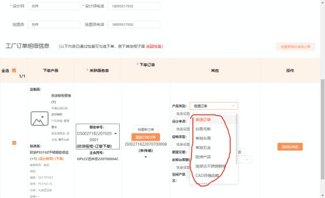

**解决方案：**

整装产品需在整装门店下单。先确定此订单的客户，是否归属在整装门店下。具体如下：

①【组织架构设置】登陆 admin 系统管理员账号， 在组织架构中单独新建整装虚拟门店， 并 关联整装实体门店。（如果没有找到整装实体门店，联系经销部商场管理员在 UC 系统后台

帮商场配置，且产品类别中需添加整装选项）；

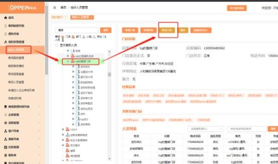

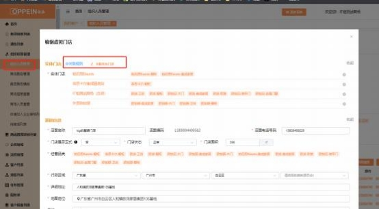

②【新客户建档下单】如是新客户， 需在第①步新建好的整装门店下建档， 在此整装门店中

下单；

③  【已建档客户下单】如果客户已在零售门店建档，需要下整装单，可以通过批量修改门 店的方式， 将客户调整至第①步新建好的整装门店下下单。批量修改路径： 客户列表-我的/

全部客户-找到对应的客户-批量修改-修改门店（整装店）。

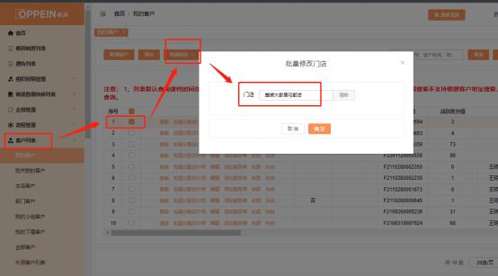

55、批量修改门店的时候， 提示： 修改失败，  没有对应的品牌品类的专业能力或

经营权限？

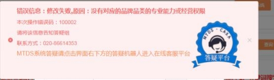

**解决方案：**

出现此提示说明：此客户下某个或多个服务单的品牌品类，在修改后的门店中 没有对应的品牌品类。需在服务单列表中，  核查该客户下所有的服务单品牌品

类，并给此虚拟门店一一关联上所有的品牌品类的实体门店。

举例： 导购给客户张三在 A 门店建档，橱柜、衣柜、木门 3 个品类的服务单， 现在导购想把客户张三批量修改到 B 门店下单。而 B 门店只关联了衣柜品类的 实体门店，仅衣柜的经营权限。当导购操作客户张三批量修改门店时，就会出

现报错：“修改失败，  没有对应的品牌品类的专业能力或经营权限”。

针对此客户，有两种解决方案：

①、admin 系统管理员在组织权限架构管理中，对 B 门店进行修改，添加关联 橱柜、木门品类的实体门店。这样此虚拟门店才有橱柜、衣柜、木门 3 个品类

的经营权限；

②、如果该客户必须批量修改门店才能下单，  且紧急又不方便操作重新关联实 体门店，可直接对橱柜、木门服务单失单处理（未收款才能操作失单）。  **注：**

不推荐操作，因为被失单的服务单，需要再在正确的门店重新建档。

**使用此修改门店功能的场景，  一般是零售单或整装单需要分开下单。  为避免重**

**复批量修改门店，针对多品牌品类商场，  建议操作如下：**

①、 admin 系统管理员在组织架构上，独立分开新建零售虚拟店和整装虚拟 店，零售店关联对应品类的零售实体门店，整装店关联对应品类整装实体门

店；

②、 admin 系统管理员在新建的零售、整装虚拟门店下，分开新建 MTDS 账   号，并给账号开通相关角色，  需拥有建档权限（导购岗位默认有建档权限）；  ③、同一个人拥有零售店、整装店的 MTDS 账号后，在登录激活账号的时候， 选择合并账号，继而后期可以通过切换账号使用。当是零售客户，导购可用零

售店的账号建档；当是整装客户，导购可切换使用整装店账号给客户建档。

**56、总部样板设计师内部代传的样品单需要下遗留单，下单时提示地**

**址有误/空白，改不了客户地址怎么办？**

**解决方案：**

第一步： 需 admin 账号登录账号，  点击“ 内部传单”菜单， 找到这个订单号，  点击 “查看”，找到下面的一行菜单， 点击“服务单信息”TAP 页， 找到“服务号 ”，复制服

务号编号；

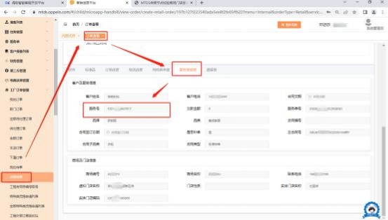

第二步： admin 账号，前往“全部客户”列表， 搜索框输入刚刚找到的服务号，  注  意根据传单时间，选取正确的“建档时间 ” ，不然时间久远的单是搜索不出来的！

找到服务号，点击“编辑 ”；

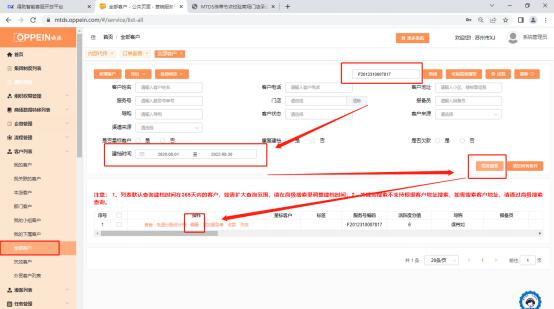

第三步：修改服务号地址，填满每一个行政区划地址和详细地址信息，点击保存，

即可；

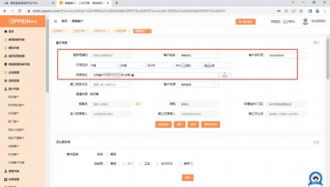

第四步：返回内部代传菜单，找到这个订单，新增遗留单，即可正常下单。

**57、提示“订单已被锁定， 传单失败，请联系管理员解锁订单”？**

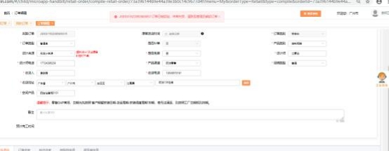

**解决方案：**

出现此提示，是因为传单点击过快重复操作所致，系统为防止商场重复下单，

自动设置成锁定状态。

商场需用谷歌浏览器登录账号，密切关注订单进度状态，  **不需要操作其他**。大  概半小时左右，  待制造系统更新进度同步至 MTDS 系统，刷新后将自动解锁订

单。

**58、提示“获取结算价系数返回数据为空， 请在 UC 端的商场管理中**

**维护结算系数， 请联系系统管员处理”？**

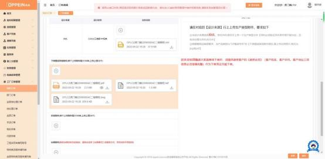

**解决方案：**

出现此提示，请联系经销部商场管理员，在 UC 系统上维护一下对应品牌品类

招商渠道的结算价系数即可。

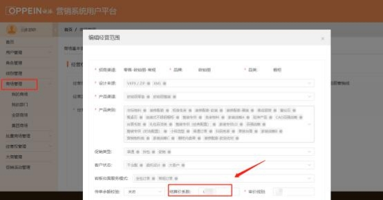

**59、订单下单界面为什么不能添加附件了？**

**解决方案：**

为避免订单信息不一致的情况出现，自 2022 年 10 月 11 日起， **订单附件来源 为设计软件一键下单的附件，不允许在 MTDS 订单详情界面增删改 ，只能通过 设计软件 CAXA 一键下单途径进行调整。**  也就是说订单下单的全部附件，全部 统一在 CAXA一键传单中上传及修改。包括： 整装装修合同、手工单、台面图、

图片等附件。

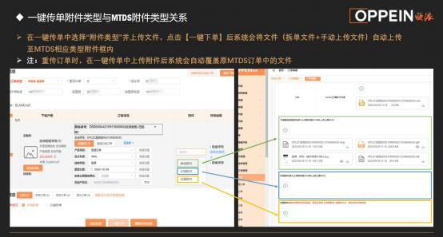

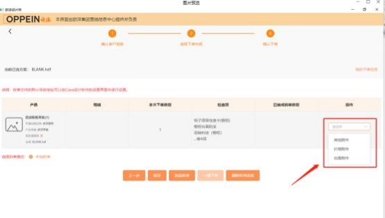

**60、提示“该主合同号批次号已达到“Z”批次，请以补单形式或新**

**建服务号服务单下单”，怎么办?**

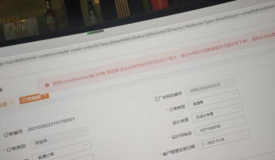

**解决方案：**  出现此提示，说明该主合同批次号已经达到系统上限“Z”批次，无

法在此主合同号下再创建订单。  有 2 种处理方案（二选一即可）：

方案一：在该主合同号已创建的订单上，直接新增补单。合同号上带“补”字；

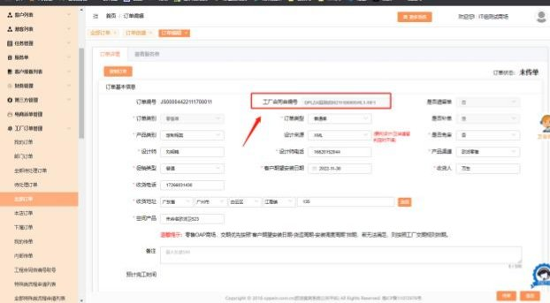

方案二：另外新增客户并新建服务单，走正常流程。最后创建的订单为新的合同

号。

**61、为什么已下单的订单补单按钮不见了？**

**解决方案：**  根据集团相关政策规定，   MTDS  系统中未发货的订单，可创建补单； 已发货的订单，  补单按钮已关闭。若您已发货的订单需要再下订单，  可以通过下

遗留单或创建新订单的方式下单。

创建新订单操作如下：

点击订单创建，  输入原订单的服务单号，  进行确认关联，  即可创建新订单，  完成

下单。注：不需要客户额外合同确认操作。

**62、订单被暂停， 商场未提交任何特殊申请， 是怎么回事呢？**

解决方案： 衣柜订单被暂停，  是因为需要齐套才排产。请检查一下订单中是否有

未扣款的订单 ，如有请及时安排汇款，订单扣款齐套后，将恢复排产。

**63、点击查看结算明细清单，提示“没有结算明细清单”？**

**解决方案：**  查看结算价明细，  提示“没有结算明细清单”，是因为该订单尚未上

传同步结算价清单。可联系**总部的商场审价员**，咨询具体结算明细清单。

**64、快速建档时，提示“调用 crm 接口失败， 原因是没有相关专业能**

**力，不允许添加”？**

**解决方案：** 此提示说明该账号没有该品牌品类的建档权限， 请联系一下**总部经销 部管理员**，核实一下 UC 后台是否将商场该品牌品类的经营权限设置为：**拟淘汰**。

若拟淘汰状态下，是无法新建档案的。

**65、添加产品时， 提示“指定订单不允许添加五金”怎么办？**

**解决方案：**

添加标准品时，提示“指定订单不允许添加五金”原因是该扫码免审遗留单修

改了产品类别/设计来源其中的字段，但是并未保存，导致后台数据无法更新。

**需关闭此页面，点击右下角保存按钮即可同步数据成功，届时再添加产品。**

**八、特殊类申请相关问题**

**1、特殊类申请单权限怎么设置呢？**

**解决方案：**  需要发起特殊类申请，首先该帐号需有特殊类申请的权限。

该权限勾选需要用系统管理员（admin）帐号勾选，操作路径如下：

组织权限管理→找到人员对应角色→商场角色管理→搜索对应角色→点“分配

权限”→工厂订单→我的订单→新增 MTDS 申请单（根据需求勾选集成家居、
