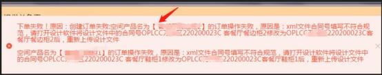
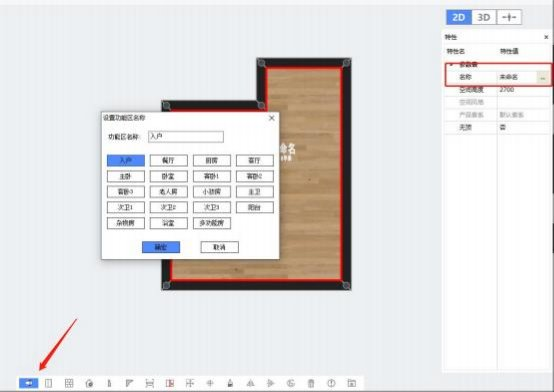
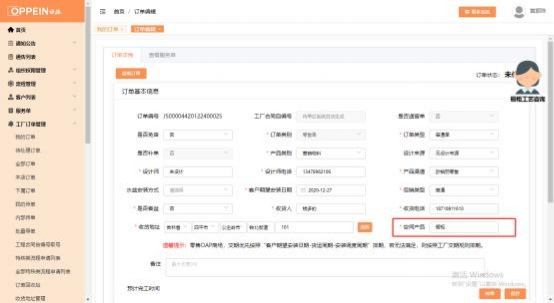

**6、传单时提示“订单页面的空间产品名《\*\*\*》订单操作失败， xml**

**合 同 号 填 写 不 规 范 ， 需 打 开 设 计 文 件 修 改 合 同 号 。**

**“**

**解决方案：** 1.请保证图纸左下角的空间产品名称与图纸右上角合同号 Y 后空间

产品名保证一致；

2\.请保证图纸两处的空间产品名与 MTDS 页面的“空间产品名”处保持一致； 3.无论是空间名、产品名命名时都不允许有空格，请删除空格重新拆单 （不能

有空格或特殊字符）。  ；

