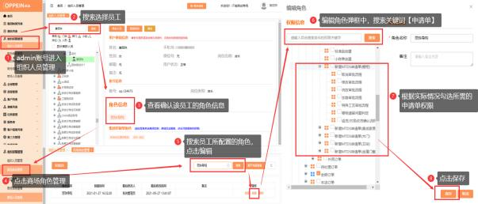
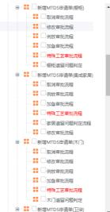

**八、特殊类申请相关问题**

**1、特殊类申请单权限怎么设置呢？**

**解决方案：**  需要发起特殊类申请，首先该帐号需有特殊类申请的权限。

该权限勾选需要用系统管理员（admin）帐号勾选，操作路径如下：

组织权限管理→找到人员对应角色→商场角色管理→搜索对应角色→点“分配

权限”→工厂订单→我的订单→新增 MTDS 申请单（根据需求勾选集成家居、

卫浴、 木门或橱柜申请单权限）  →保存。如下图示：

