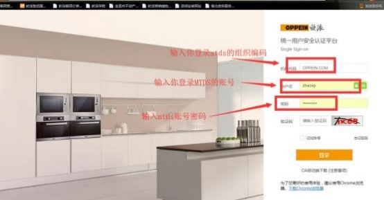
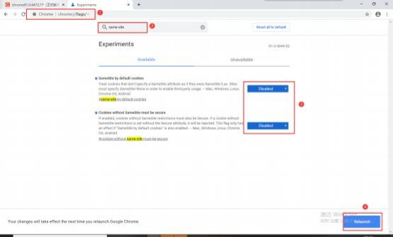
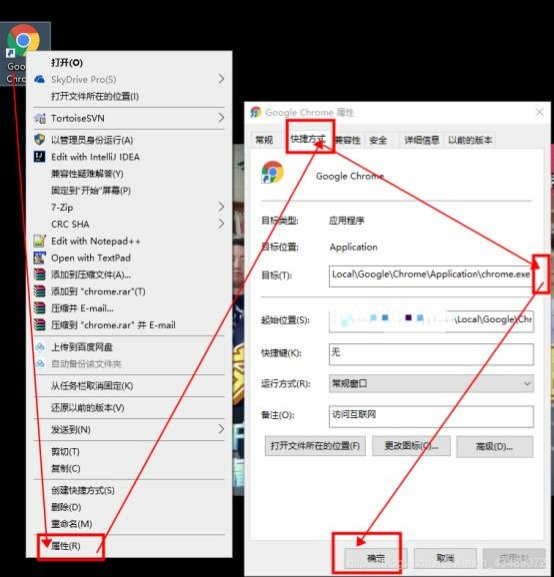

**11、点击新增特殊审批时提示需要登录账号， 怎么处理？**

**解决方案：**

点击新增对应审批时，如仍需登账号，请按照上图模板，输入正确的 MTDS 商

场组织编码、账号、密码登录一下即可。

若登录系统输入验证码， 明明输入正确却显示“验证码输入错误”提示，请按以

下指引设置：谷歌浏览器右上角三个点-设置-关于 Chrome-查看当前版本：

**（1）91.0.4472.77 之前版本解决方法：**

336

①谷歌 chrome 浏览器地址栏输入 chrome://flags/

②搜索栏输入 same-site

③搜索结果的两项设置为 disabled

③ 点击右下角  Relaunch

**（2）91.0.4472.77 之后版本解决方法：**

**Windows 系统解决方案：**在桌面的谷歌快捷方式：右键-属性，将下面文字复

制添加到最后面确定即可。（注意最前面有个空格别忘了，不然报错）：

--disable-features=SameSiteByDefaultCookies,CookiesWithoutSameSiteMustBeSecure

337

**Mac 系统解决方案：**

① 谷歌浏览器完全退出，  注意菜单栏 chrome 下面的小黑点 ，没有完全退出需

要双击退出

②打开控制台，输入：

open -a "Google Chrome" --args --disable-features=SameSiteByDefaultCookies

② 正常登录 pms 即可

338

