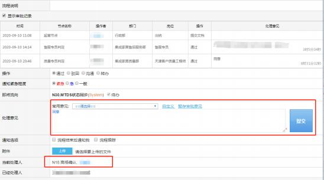

**15、传单时系统提示： 含有未审批通过的遗留问题判定流程（或其他**

**特殊类申请）， 怎么处理？**

**解决方案：①**需确认遗留判定或特殊类申请的流程处理状态， 是否为审批通过；

也可点击流程编号，查看审批记录，确认当前处理人是谁。

**②**委托设计或遗留责任判定的流程若在【商场确认】环节，  需登录流程发起人的

账号，点击流程编号操作处理意见（如下图）。

340

