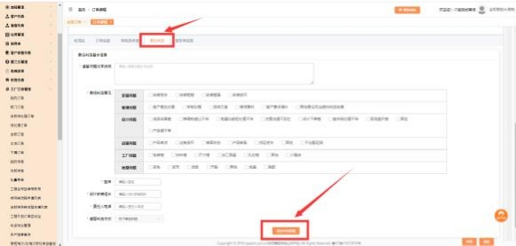
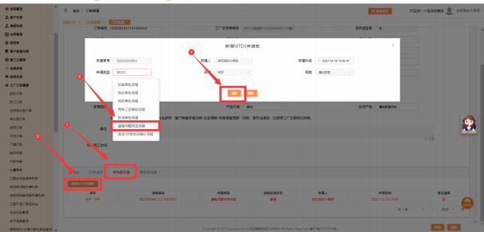

**16、怎么发起遗留判定？**

**解决方案：**①橱柜品类： 新增遗留单，  在遗留单的基础上点击编辑进入订单详 情页， 下拉点击【责任判定】tab 栏， 填写相关信息后点击保存判定依据，  点击

传单。（图一）

②除橱柜外的其他品类： 新增遗留单， 在遗留单的基础上点击编辑进入订单详情 页， 下拉点击【特殊类申请】tab 栏， 点击新增 MTDS 申请单， 申请类型选择遗

留问题判定，在审批页面中填写相关信息。（图二）

341

图一

图二

342

