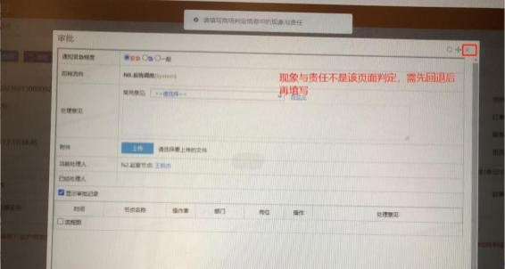
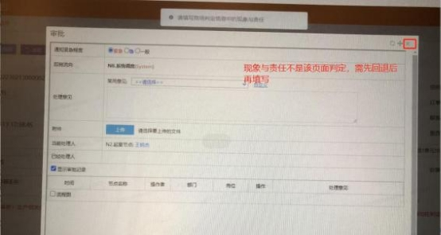
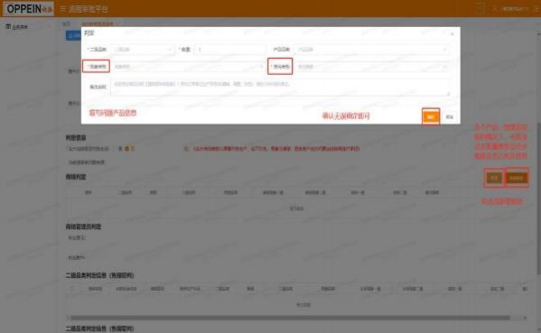

**18、提交遗留单判定时出现：“请填写商场判定信息中的现象与责任”**

**如何处理？**

**解决方案：**

提交遗留单判定时出现： “请填写商场判定信息中的现象与责任”，具体操作如

下：

344

1、先关闭当前审核页面，点击右上角透明 X 按钮（如图一）

（图一）

2、在流程审批平台，找到【商场判定】字段，点击下方修改按钮，  填写现象与

责任，保存后即可生效（如图二）

（图二）

345

注： 若有多个产品不同原因，均需手动修改一次； 如果同一个原因导致，  可用右

侧批量修改按钮，  其他产品会批量修改为同一种现象与责任。

