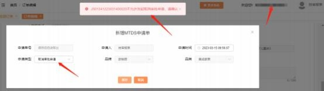
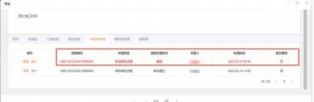

**19、提示：“不允许发起取消审批申请， 请确认”？**

**解决方案：** 出现此提示，可能有以下两种情况：

**情况一、**请先核查一下订单目前的状态。若订单处在以下状态下**不能发起取消审 批申请**：未传单、传单失败、传单中、标准品 K3 调度完成、标准品已发货，等

待收货。

**情况二：**请检查一下特殊类申请单中， 是否已存在取消审批流程。若已有草稿状 态的取消审批流程，  直接点击编辑进去填写信息，  提交成功即可。不用重复申请

取消审批流程。

346

347
