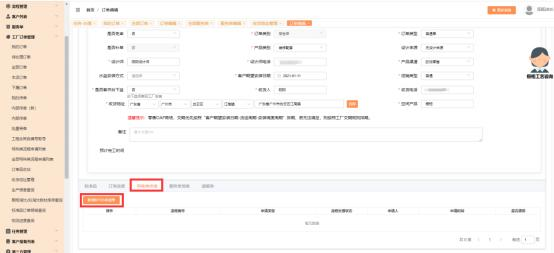

**2、请问申请单入口在哪？需要注意哪些事项？**

**解决方案：**  在 MTDS 中发起特殊类申请，统一的位置为：

工厂订单→我的订单→编辑→特殊类申请（工艺审批、 加急、修改、取消

等），但是不同品类会出现不一样的申请单入口：

**注意事项：**选择对应的申请单类型,点击确定，进入审单页面填写信息.后点击提 交出现“草稿”状态， 点击“流程实例编码”进入申请页面，  点编辑， 填写信息

后点提交。其木门部分取消是需要发起修改单；木门整单取消即可发起取消单。

