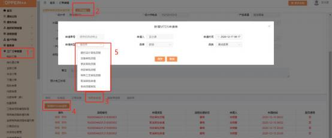
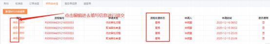

**3、特殊申请单怎么提？**

**解决方案：**    “我的订单”列表， 点击“编辑”进入订单下单界面，  找到特殊类申

请请入口。

注：如果选择对应的申请单后，不能直接跳转到申请单界面，显示“草稿”状态，则

点击“编辑”进入申请界面，编辑填写信息后， 点提交。

**常见规则：**

①**特殊工艺审批**：未传单、已退回、技术审核不通过、传单失败、遗留单审核不 通过这五种状态才可以申请， **橱柜品类订单状态为包装完成、入库中、已入库时**

**也可发起特殊工艺审批**；

②**修改审批**：集成家居品类订单（除单独五金外） ，只有技术审核中/WCC 技审 /编程审核中/QC 审核中/趟门下单中/价格审核中/价格审核不通过/扣款通过，

以上状态允许发起修改审批；

③已退回状态订单不允许发起加急审批

④取消审批、遗留责任判定、申诉流程、返货对色、卫浴委托设计流程，  一个订

单仅允许发起一次

