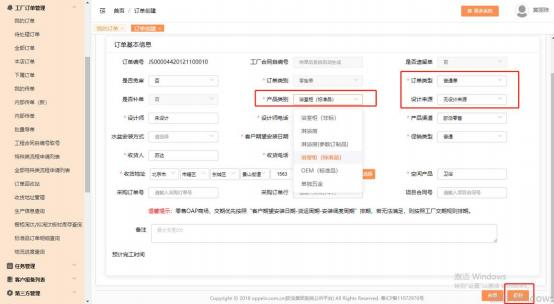
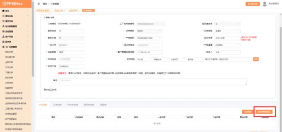
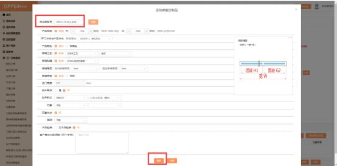
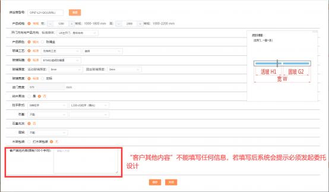
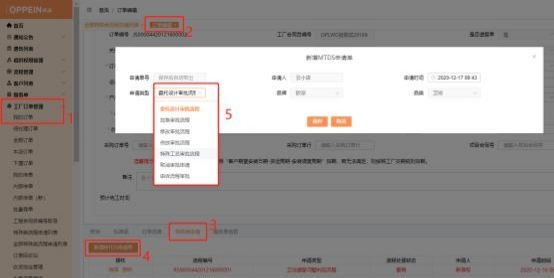

**8、卫浴淋浴房一定要发起委托申请吗？如何操作？**

**解决方案：** 卫浴的淋浴房不一定要发起委托设计。

① 标准品直接 MTDS 系统中传单，操作如下：

工厂订单－我的订单－编辑进入订单下单的界面，产品类别选择“淋浴房（参 数订制品） ”，设计来源不需要选择，填写其他必填项后点击保存（图 1）， 点击“添加参数订制品” （图 2），输入淋浴房型号-点击“查看”， 填好产 品型号、工艺、颜色等相关信息后点击保存参数订制品（图 3），“客户其他 内容”不能填写任何信息，如填写后系统会提示必须发起委托设计 （图 4）.

标准品选择好后，在订单编辑界面保存传单即可。

330

331

② 非标淋浴房传单，操作如下：

工厂订单－我的订单－编辑进入订单下单的界面， 产品类别选择“淋浴房（参数  订制品） ”，设计来源不需要选择，填写其他必填项后点击保存（图 1）， 点击  “添加参数订制品” （图 2），输入淋浴房型号-点击“查看”， 填好产品型号、  工艺、颜色等相关信息后点击保存参数订制品（图 3），非标尺寸在“客户其他  内容”中备注， 如有其它设计要求可在客户其它内容里填写以及上传相应附件， 之后点击右下方“保存参数定制品”（图 4），保存了淋浴房参数信息之后，  同  样需发起委托设计申请：  在特殊类申请-新增 MTDS 申请单-申请类型-委托设计  审批流程（图 5） ，点击流程实例编号，  进入委托设计审批界面（图 6），在委  托设计审批的界面点击“编辑” （图 7），设计要求可填写“按照之前参数定制  品非标信息设计”，也可再上传非标产品“设计要求”和附件，二者任选其一，

之后再点击右上方提交即可（图 8）。

332

333

334

