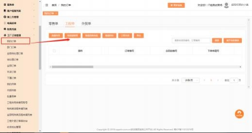
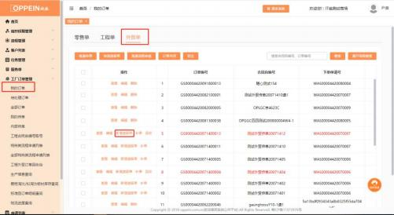
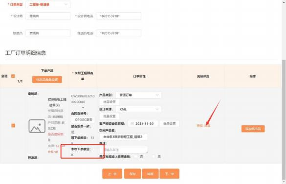
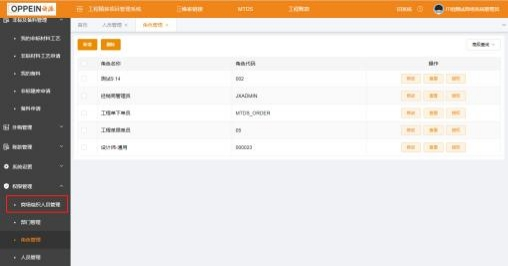
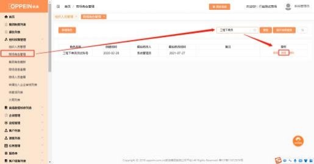
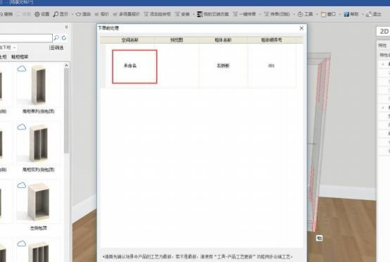
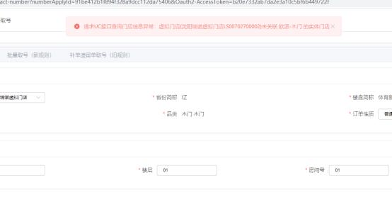
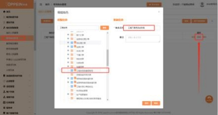



**九、 工程传单相关问题**

**（一）通用问题：**

**1、工程经销商咨询渠道：**

**解决方案：** 微信/QQ 通讯软件在 2021 年 11 月 22 号集团会关掉，现都是企业 微信沟通，需要加群的经销商，可以加许文学老师的企业微信，也可以让内务

主管或同事在群里拉进群

**2、加入企业微信解答群，以前的培训学习资料怎么找？**

**解决方案：** 可以看群聊天置顶有文档，打开有链接去查看

;

**3、工艺问题咨询渠道：**

**解决方案：**

**①** 软件有解答功能[（电子手册实现一秒内找到产品工艺）](https://mp.weixin.qq.com/s?__biz=MzU3MTM5MTkwNQ==&mid=2247500532&idx=5&sn=fffa05ba913faef96905ee6997500c2a&chksm=fce2683acb95e12c489d59c5527dfa7306e70696ccfc17ffb28cba2a5887ab2a0208cf05d70a&mpshare=1&scene=1&srcid=1115D5KVrQtZRNZCsVmUGw93&sharer_sharetime=1636960514621&sharer_shareid=cfcd208495d565ef66e7dff9f98764da&version=3.1.16.5505&platform=win#rd)或者微信公众号搜索

《欧派工艺体系平台》

**②** 联系对应品类的工艺部解答

**4、工程经销商传单流程简介：**

**解决方案：**

衣柜： 下单流程工程经销商传单流程：登陆工程精装平台-进入订单管理菜单 -  合同订单界面－找到建好的合同订单申请－点击详情进入合同订单详情页－在 详情页点击发起传单按钮-创建好服务单，  跳转到 MTDS 页面填写订单信息，  普 通单上传设计文件，  标准品单选择对应的标准品、填写数量，  点击传单即可传单

成功；

橱柜/卫浴： 下单流程工程经销商传单流程：登陆工程精装平台-进入订单管理菜 单－合同订单界面－找到建好的合同订单申请－点击详情进入合同订单详情页 -在详情页点击发起传单按钮-创建好服务单-回 CAXA 一键传单-填写好资料-

上传 MTDS-回 MTDS，我的订单界面点击传单即可传单成功.

**5、工程传单的网址是什么？**

**解决方案：** 工程传单的网址是： [https://gcpm.oppein.com](https://gcpm.oppein.com/)

**6、登录精装系统问题：认证信息无效，怎么办？**

**解决办法：**  请检查组织编号账号密码是否填写有误，确认后重新输入，或者用

admin 账号重置密码后登录**。**

**7、工程衣柜普通单怎么传？**

**解决方案：**登陆工程精装平台-进入订单管理菜单－合同订单界面－找到需要传

单的合同－点击详情进入合同订单详情页 （下图一）－在详情页点击发起传单

按钮 （下图二） ，跳转到 MTDS 工程服务号详情界面，客户基本信息和工程基 本信息自动从工程精装平台带过来，  只需填写户型，选择是否补单、是否一键  下单后点保存，  出现创建工程订单的按钮 （下图三），点击创建工程订单的按  钮，跳转到订单传单的界面，  填写界面的必填项 （下图四） ，点击保存， 如果

有多套订单， 商场可以下载工程外贸批量模板的 excel 表，上传填写好的表

格，文件名不可变更，系统会自动校验文件中合同自编号是否重复及文件名是

否合法。通过传单校验后，点击保存，传单成功。

**8、工程标准品单怎么传？**

**解决方案：** 和工程普通单一样的操作方式，走到 MTDS 传单界面，  填写相关必

填信息，产品类别选择对应的标准品，  保存后，点击“添加标准品”的按钮，

选择需要下单的标准品，填写要下单的数量，点传单即可。

**9、在 MTDS 传单的工程单补单怎么传？**

**解决方案：** 不能在工程外贸订单列表中找到需要传补单的原合同， 点击“补单” 的按钮， 跳转至订单详情界面；需要单独填写合同订单申请，  取补单号，  发起传

单和正常订单方式一样操作。

**10、不在 MTDS 传单的工程补单怎么传？**

**解决方案：** 不在 MTDS 传单的工程补单建议使用新的合同号，按正常工程订单

流程走。

**11、这种补单有没有办法批量取号?**

**解决方案：** 批量补单取号要在补单遗留单取号（旧规则）里操作，可以在下单

申请号或服务单号搜索。

**12、原合同不在 MTDS 传单的工程遗留单怎么传？**

**解决方案：** 在工程外贸订单列表中点击“快速遗留单”的按钮， 输入正确的原合

同自编号，点击关联，跳转至订单详情界面，和正常单一样操作传单即可。

注： 合同号会自动带遗字！

**13、原合同在 MTDS 传单的工程遗留单怎么传？**

**解决方案：** 在工程外贸订单列表中找到需要下遗留单的原合同， 点击“新增遗留单”的按钮（需传完单的才可以有此按钮），跳转至订单详情界面，和正常单一

样操作传单即可。

注： 合同号会自动带遗字！

**14、批量遗留单怎么下单？**

**解决方案：**

①入口：订单列表-工程单-快速遗留单；

②点击快速遗留单，关联原单，选择是否单套；

③若【是否单套】选择是，则视为单个下单，订单套数为 1；

④若是否单套选择否， 则视为批量遗留单，需进行取号操作， 批量取遗留单号；

⑤取号规则和正常取号一致，允许批量取遗留单号；

⑥若需批量取号， 请通过服务号或下单申请搜索， 勾选需要下遗留单的订单进行

取号。

**15、遗留单怎么套数为 0？**

**解决方案：** 在变量设置里选择是否下单

**16、原单是整单不一致的，现在下遗留单套遗留单下不下去，提示整**

**单不一致，需要设置变量**

**解决方案：** 直接在 CAXA 软件里点中一块板材设置成有变量数据，这样服务单 的整单不一致和 CAXA 软件设置了变量（整单不一致） 相同， 这样才能操作（单

独台面是不校验的）

**17、现在工程台面怎么下单？**

**解决方案：** 样板不需要台面线上备料，批量需要线上备料；批量台面下单有 2

种， 1 是台面和柜子门板一起下单；  2 是单独台面下单

**18、单独台面怎么下单？**

**解决方案：** 单独台面下单时候，必须走补单方式下单，做下单申请的产品品类

要选橱柜，不要选台面；  一键下单选是(只能从软件走)，橱柜在产品类别选单

独台面，卫浴在产品类别选浴室柜非标。

**19、工程的 CY 单怎么传**

**解决方案：** 需正常取号（选普通单），然后在 MTDS 界面选择 CY 单即可。

**20、工程的百货能在 CAXA 软件下吗**

**解决方案：** 样板间订单的百货可以和订单一起下，批量订单需要单独百货下单

**21、传单时提示“客户电话不合法”怎么处理？**

**解决方案：** 需要去到工程精装平台里面的客户电话是否有特殊字符，  例如： 空格

键，如果还解决不了可以联系工程管理员协助解决。

**22、为什么出现提示“请求超时”？**

**解决方案：** admin 账号不是在门店下， 不能发起新增订单；需要用工程单下单员

的账号操作。  （同时需要 admin 账号给对应下单员配置合同自编号的权限）

**23、工程的空间产品名在哪填写？**

**解决方案：** 衣柜的空间产品名需要在设计文件，  下单前设置里填写带出来。（此

空间名会打印在标签上）。

**24、无法提交备料申请怎么办？**

**解决办法**：需清缓存重新进来，  或者重新在精装平台打开待办单据，  点开审批界

面。

**25、木门取号报错怎么办？**

**解决办法**：检查一下品牌是否选择正确，欧派应该选择为欧铂尼品牌。

**26、 MTDS 传单报错：门店 ID 不能为空，或者门店编码不能为空，**

**怎么办？**

**解决方法：**  需检查该门店是否是工程门店，需使用工程下单员账号发起传单。

**27、为什么我的下单账号取不了号？**

**解决方案：** 需要 admin 账号给对应账号勾选对应的取合同自编号权限。

**28、样板间需要传合同自编号表格么？**

**解决方案：** 需要的， 取号是取号   （取号只是规范合同号）， 下单是下单（下单

就按正常流程操作）  。注意：所有取号的合同号是不能手动修改。

**29、提示“设计文件订单类型选项不符，请重新修正后上传”？**

**解决方案：** 需检查订单界面的订单类型，合同号性质，和设计软件的订单类型是

否一致。

**30、卫浴柜在发起传单空间名填主卫，次卫，那同一个房间的合同号**

**就是重复的。怎么处理？**

**解决方案：** 需用方案序号不同来区分。

**31、保存服务单出现以下报错怎么处理？**

解决方案：该提示是指所建的服务单中的合同套数大于合同订单申请中的总套数

数量，需要在工程服务单中排查是不是多建了服务单（可以填入下单申请号搜索）

**32、系统提示：“订单页面的是否遗留单与设计文件中的标志不一致，**

**请重新确认！**

解决方案：因为订单界面的是否遗留单和附件的是否遗留单不一致导致此提示。

订     单     界     面     的     遗     留     单     标     识     如     下     图     ：

CAXA 软件上传文件的遗留单标识如下图：

**33、工程外贸批量模板 excel 的非重复合同自编号的数量要等于套数？**

**解决方案：** 因工程外贸批量模板的合同号个数与在 MTDS 的套数数量对不上，

需要调整数量一致。

**34、提示“未生成订单无法传单?**

**解决方案：** 需要先检查所有信息正确后，点击保存后，才能传单。

366

**35、提示“请确认方案套数， 避免重复生成”?**

**解决方案：** 此提示为温馨提示，  只要是没用过的合同号，按确认就可以。

**36、需要重传的订单， 修改订单类别编辑不了？**

**解决方案：** 退回的订单不能修改订单类别， 如需修改只能重新做新的订单操作流

程，合同号也要换新的。

**37、提示“所选订单不在同一个下单申请号， 无法批量传单”?**

**解决方案：** 正常订单是一定要有下单申请号的，同一批下单申请号是一样的。 1，这个是操作错误导致的，如在 MTDS 上填写第一个订单资料，保存后没有 复制订单，就在第一个订单资料中操作第二个订单的资料，导致出错，可以直

接找许主管和曹主管（3 次错误者自己解决）；

2，检查是不是在同一个订单申请里操作，如果不是，先删掉没有下单申请号的

方案，重新在正确的订单申请发起传单。

**38、我把退回来的订单放在回收站了，再上传就提示下单套数超了？**

**解决方案：** 回收站只是把退回的订单放在回收站列表里，不代表取消，还是占着

套数名额，需要提取消申请看通过后，或关闭订单才能释放套数名额。

**39、橱卫工程单需要重传，但是文件怎么不能删除？在 CAXA 里面显示此单号已存在传不了， 怎么操作呢？**

**解决方案：** CAXA 文件重传是需要在一键传单里操作，需点对应的子订单操作。

**40、提示： “ 工程外贸批量模板里面的工厂合同自编号 ，含有非**

**MTDS 系统生成的，无法使用，请在 MTDS 系统取号再使用“？**

**解决方案：** 此提示说明使用的合同号不是系统取号的，需要在系统取号，如果是系统取的号， 就要看看有没有复制错可以把复制的合同号放在取号的文档里搜

索，没有搜索到的可以手动填入。

**41、跳转 vfdp 平台是什么原因？**

**解决方案：** 进了零售系统，需要退出，从工程精装平台进去。

**42、为什么选择原订单的时候搜索不到原单号？**

**解决方案：** 先要点中补单遗留单取号，再输入原单合同号搜索

**43、提示乱码怎么办？**

**解决方案：** 网页出现英文字母，或者乱码，先清理页面缓存，关掉页面再进；

如果还是不行，应该是 CAXA 文件备注过多，超过 500 字符。

370

**44、一键传单第三步提示很多英文，怎么办？**

**解决方案：** 检查上传文件名是否过长或有特殊字符，  #~^;¤    目前是这 5 个特

殊符号不可以

**45、方案序号可以重复吗？**

**解决方案：** 同一批次订单中，不同方案，序号不能重复

**46、提示“缺失工程精装平台跳转所需的参数”怎么办？**

**解决方案：** 该问题需报给工程信息化专员处理。

**47、项目简称长度不能超 5 个字符？**

**解决方案：** 提供备案号以及修改成\*\*项目简称（5 个字以内）  的资料给总部管

理员或姚婷婷信息专员处理。

**48、 MTDS 无法传单：产品渠道不在 UC 系统配置的产品渠道内怎**

**么办？**

**解决办法：**  此报错是因为选错门店下单，需选工程门店下单，解决不了找总部

管理员操作。

**49、 MTDS 传单，当产品类型选为礼包百货类时报错怎么办？**

**解决办法：**  需要找工程管理员在 UC 后台维护好 K3 编码后，点保存即可跳转到

居家匠人平台下单。

**50、工程服务单状态显示建单失败是什么情况？**

**解决方案：** 在 CAXA 里-里看拆单备注里提示什么问题，改好重传即可。

**51、发起了一个取消审批的流程，到现在还没有下一步该联系谁催一下？**

**解决方案：** 联系总部管理员要对应计划员的联系方式。

**52、一键下单拆单提示这个是什么意思？**

**解决方案：** 要注意当前合同自编号的订单性质是什么，再看订单类型是什么，

两者订单性质要对应。

**53、下单时系统提示附件大小不能为 0，怎么办？**

**解决方案：** 进入订单查看 XML 文件大小，发现为 0KB 的订单，删掉重新传

**54、提示设计文件合同号和合同号文档的第一条合同自编号不一致**

**解决方案：** 这个提示来源衣柜手工传单，设计师检查设计文件中的用户设置，

工厂合同自编号填写的是不是和合同自编号中第一个合同号一致

,

**55、一键传单中的“是否发起线上非标审批”是要如何操作的？**

**解决方案：** 在一键传单中，新增了一条选择，图里提示是你这个模型订单有没 有非标审批表，如果有就选是，可以直接跳到非标申请单号进行选择，如果没

有申请审批，就选否就行

**56、拆单时备注说明提示服务单更新覆盖下单是什么意思？**

**解决方案：** 注意在一键传单第二步，选择对应的服务单

**57、在工程服务单状态提示建单失败，怎么办？**

**解决方案：** 回 CAXA 查看我的下单任务，在我的下单任务和拆单详细看备注提

示什么，跟进提示做修改再重新拆单。

**58、CAXA 没有卫浴工程模块，所以用欧派的模型传欧铂丽工程， 被**

**退了，是什么原因？**

**解决方案：** CAXA 是有工程欧铂丽卫浴模块的，如果账号登录设计软件里没

有，就联系管理员或自己购买工程欧铂丽卫浴模块权限。

**59、提示合同号自编号已存在怎么处理？**

**解决方案：** 提示意思就是该合同号已经使用过，  建议换新的合同号操作，  可以改

方案序号，这样就不会影响到楼栋号

**60、拆单出现以下提示与怎么办？**

**解决方案：** 检查一下模型文件有没有错误（建库模型要重点检查） ，或者新建个

空间，把模型复制过去再重新拆一下。

**61、 MTDS 电子画册是空白的，**

**解决方案：** 需要系统管理员 admin 前往商场角色管理，给配置电子手册的权限

