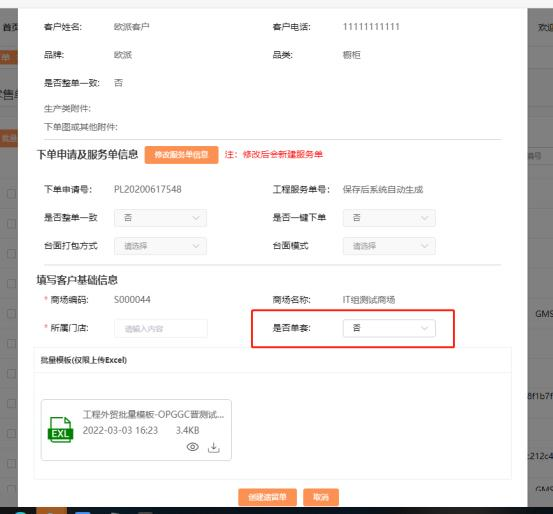

**14、批量遗留单怎么下单？**

**解决方案：**

①入口：订单列表-工程单-快速遗留单；

②点击快速遗留单，关联原单，选择是否单套；

③若【是否单套】选择是，则视为单个下单，订单套数为 1；

④若是否单套选择否， 则视为批量遗留单，需进行取号操作， 批量取遗留单号；

⑤取号规则和正常取号一致，允许批量取遗留单号；

⑥若需批量取号， 请通过服务号或下单申请搜索， 勾选需要下遗留单的订单进行

取号。

