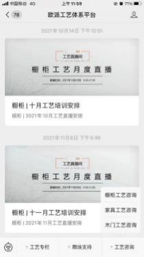

**3、工艺问题咨询渠道：**

**解决方案：**

**①** 软件有解答功能[（电子手册实现一秒内找到产品工艺）](https://mp.weixin.qq.com/s?__biz=MzU3MTM5MTkwNQ==&mid=2247500532&idx=5&sn=fffa05ba913faef96905ee6997500c2a&chksm=fce2683acb95e12c489d59c5527dfa7306e70696ccfc17ffb28cba2a5887ab2a0208cf05d70a&mpshare=1&scene=1&srcid=1115D5KVrQtZRNZCsVmUGw93&sharer_sharetime=1636960514621&sharer_shareid=cfcd208495d565ef66e7dff9f98764da&version=3.1.16.5505&platform=win#rd)或者微信公众号搜索

《欧派工艺体系平台》

**②** 联系对应品类的工艺部解答

