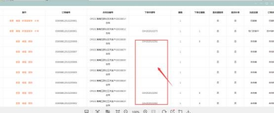

**37、提示“所选订单不在同一个下单申请号， 无法批量传单”?**

**解决方案：** 正常订单是一定要有下单申请号的，同一批下单申请号是一样的。 1，这个是操作错误导致的，如在 MTDS 上填写第一个订单资料，保存后没有 复制订单，就在第一个订单资料中操作第二个订单的资料，导致出错，可以直

接找许主管和曹主管（3 次错误者自己解决）；

2，检查是不是在同一个订单申请里操作，如果不是，先删掉没有下单申请号的

方案，重新在正确的订单申请发起传单。

