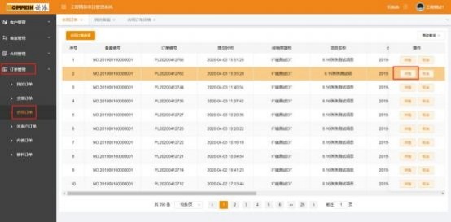
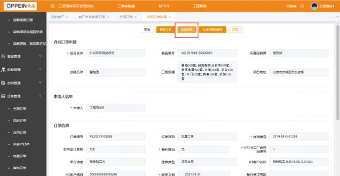
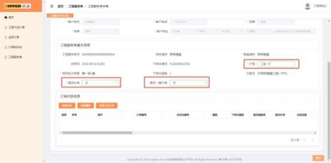
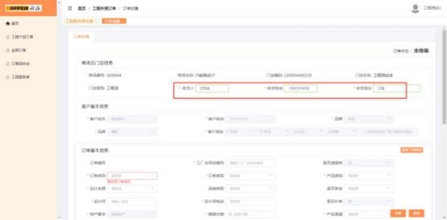

**7、工程衣柜普通单怎么传？**

**解决方案：**登陆工程精装平台-进入订单管理菜单－合同订单界面－找到需要传

单的合同－点击详情进入合同订单详情页 （下图一）－在详情页点击发起传单

按钮 （下图二） ，跳转到 MTDS 工程服务号详情界面，客户基本信息和工程基 本信息自动从工程精装平台带过来，  只需填写户型，选择是否补单、是否一键  下单后点保存，  出现创建工程订单的按钮 （下图三），点击创建工程订单的按  钮，跳转到订单传单的界面，  填写界面的必填项 （下图四） ，点击保存， 如果

有多套订单， 商场可以下载工程外贸批量模板的 excel 表，上传填写好的表

格，文件名不可变更，系统会自动校验文件中合同自编号是否重复及文件名是

否合法。通过传单校验后，点击保存，传单成功。

