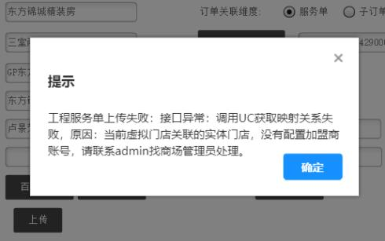
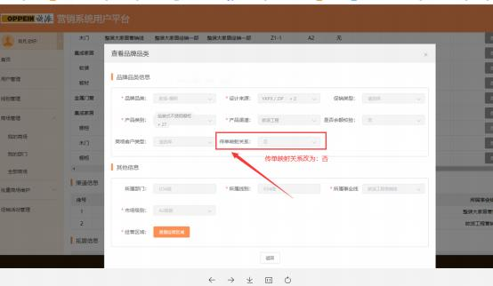

**（二）橱柜专项操作异常解答：**

**1、一键下单时提示“工程服务单上传失败：接口异常：调用 UC 获 取映射关系失败，原因： 当前虚拟门店关联的实体门店，没有配置加**

**盟商账号，请联系 admin 找商场管理员处理”？**

**解决方案：** 由管理员或者信息化专员通过登录工程精装平台-商场管理

-经营品类及渠道信息，修改具体品类中的品牌品类信息， 将“传单

映射关系”修改为“否”。

