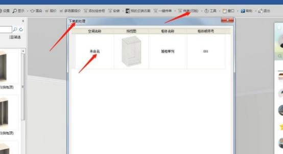

**（三）衣柜专项操作异常解答：**

**1、我要下东泰全盖铰链 ，我有非标审批，但是这个该怎么下？**

**解决方案：** 衣柜订单，  经销商如需要单下非标的五金（有审批表） ，就联系曹远

仪主管建进 CY 库了，下 CY 单。

**2、没有上传文件的+号怎么办？**

**解决方案：** 订单类型，产品类别，设计来源没写。

**3、衣柜取号处都有范例单的选项？**

**解决方案：** 衣柜是没有范例单的。

**4、请问现在衣柜是取号 我该怎么下特急呢？**

**解决方案：** 下完单，在特殊流程里面有加急可以选。

**5、我取消了订单再上传就需要改合同号吗？**

**解决方案：** 上传到工厂的合同是不能再用，如上传订单是因为合同号错误，导

致退单，是不能改合同号重传的，只能换新的合同号，按正常订单流程上传。

**6、产品类别里选不到扫码遗留单怎么办？**

**解决方案：** 工程衣柜没有扫码遗留单。

**7、系统取的合同号不能写柜子名称怎么办，分货不好分？**

**解决方案：** 在传单（旧版）里的下单前处理，填好空间名称和柜体名称，等

MTDS 保存后系统会捕捉 CAXA 文件的信息带过去。

**8、衣柜的工程单不能一键传单是什么情况啊？**

**解决方案：**  目前工程只有橱卫是一键下单流程，工程衣柜是手工传单流程。

